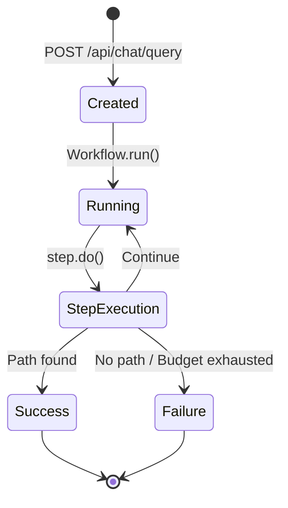
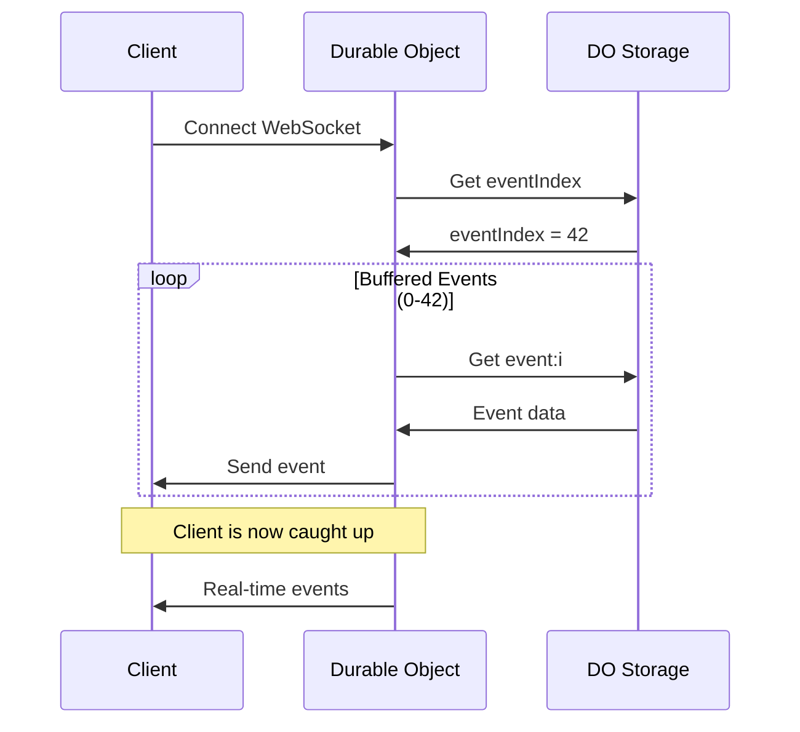
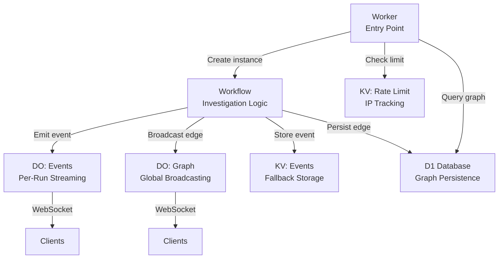

Connected leverages the full Cloudflare developer platform to build a serverless, globally distributed architecture. Each service plays a specific role in the investigation pipeline.

## Cloudflare Workers

**Purpose**: Edge-native API orchestration and request routing

### Configuration (wrangler.toml)

```toml
name = "visual-degrees-worker"
main = "src/index.ts"
compatibility_date = "2024-12-01"
compatibility_flags = ["nodejs_compat"]

[vars]
AWS_REGION = "us-east-1"
ALLOWED_ORIGINS = "https://vd.nintang48.workers.dev,http://localhost:3000"
```

### Key Responsibilities

1. **HTTP Request Handling**: All API endpoints (`/api/chat/query`, `/api/graph`, etc.)
2. **Rate Limiting**: 50 searches per day per IP using KV storage
3. **CORS Management**: Dynamic origin validation for cross-origin requests
4. **Workflow Orchestration**: Creating and managing investigation workflow instances
5. **Database Queries**: Fetching graph data from D1 for visualization

### API Endpoints

| Endpoint | Method | Purpose |
|----------|--------|----------|
| `/api/chat/query` | POST | Start new investigation |
| `/api/chat/stream/:runId` | GET | SSE event stream |
| `/api/chat/events/:runId` | GET | Poll-based events |
| `/api/chat/parse` | POST | Parse natural language query |
| `/api/chat/ws/:runId` | GET | WebSocket upgrade for events |
| `/api/graph` | GET | Full verified graph |
| `/api/graph/path` | GET | Shortest path lookup |
| `/api/graph/ws` | GET | WebSocket upgrade for graph updates |
| `/api/health` | GET | Service health check |

### Rate Limiting Implementation

```typescript
// Rate limit: 50 searches per day per IP
const RATE_LIMIT_MAX = 50;
const RATE_LIMIT_WINDOW = 24 * 60 * 60; // 24 hours

async function checkRateLimit(env: Env, ip: string) {
  const key = `ratelimit:${ip}`;
  const data = await env.RATE_LIMIT.get(key);
  
  if (!data) {
    await env.RATE_LIMIT.put(key, JSON.stringify({ count: 1, resetAt }), {
      expirationTtl: RATE_LIMIT_WINDOW,
    });
    return { allowed: true, remaining: 49 };
  }
  
  // Check and increment...
}
```

## Cloudflare Workflows

**Purpose**: Durable execution engine for multi-step investigation state machine

### Configuration

```toml
[[workflows]]
name = "investigation"
binding = "INVESTIGATION_WORKFLOW"
class_name = "InvestigationWorkflow"
```

### Why Workflows?

1. **Durable Execution**: Investigations can run for minutes without timing out
2. **Automatic Retries**: Failed external API calls retry transparently
3. **State Persistence**: Progress survives Worker restarts
4. **Subrequest Limits**: Workflows bypass the 1000 subrequest limit per Worker invocation

### Workflow Lifecycle



### Creating a Workflow Instance

```typescript
// In Worker (apps/worker/src/index.ts)
const runId = crypto.randomUUID();
const instance = await env.INVESTIGATION_WORKFLOW.create({
  params: { personA, personB, runId }
});

return Response.json({
  id: instance.id,
  runId,
  status: "started"
});
```

### Workflow Steps

Each `step.do()` call creates a durable checkpoint:

```typescript
// In WorkflowEntrypoint (apps/worker/src/workflows/investigation.ts)
const directEdge = await step.do("direct-attempt", async () => {
  const searchRes = await searchImages({ query });
  const analysis = await detectCelebrities({ imageUrl });
  // If this fails, Workflow retries from this checkpoint
  return createVerifiedEdge(personA, personB, evidence);
});
```

## Durable Objects

**Purpose**: Stateful WebSocket broadcasting and event management

### Configuration

```toml
[durable_objects]
bindings = [
  { name = "GRAPH_BROADCASTER", class_name = "GraphBroadcaster" },
  { name = "INVESTIGATION_EVENTS_BROADCASTER", class_name = "InvestigationEventsBroadcaster" }
]

[[migrations]]
tag = "v1"
new_sqlite_classes = ["GraphBroadcaster"]

[[migrations]]
tag = "v2"
new_sqlite_classes = ["InvestigationEventsBroadcaster"]
```

### Two Durable Object Types

#### 1. GraphBroadcaster (Singleton)

- **Instance**: One global instance (`idFromName("global")`)
- **Purpose**: Broadcast newly discovered edges to all connected clients
- **Use Case**: Real-time graph visualization updates

```typescript
// Broadcasting a new edge
const id = env.GRAPH_BROADCASTER.idFromName("global");
const stub = env.GRAPH_BROADCASTER.get(id);
await stub.fetch(new Request("https://internal/broadcast", {
  method: "POST",
  body: JSON.stringify({ source, target, confidence })
}));
```

#### 2. InvestigationEventsBroadcaster (Per-Investigation)

- **Instance**: One per investigation (`idFromName(runId)`)
- **Purpose**: Stream investigation events to connected clients
- **Features**:
  - Event buffering in DO storage
  - Replay for late joiners
  - Hibernatable WebSockets
  - Auto-cleanup after 1 hour

```typescript
// Connecting to investigation stream
const id = env.INVESTIGATION_EVENTS_BROADCASTER.idFromName(runId);
const stub = env.INVESTIGATION_EVENTS_BROADCASTER.get(id);
return stub.fetch(new Request("https://internal/ws", request));
```

### Hibernation Support

Durable Objects can "hibernate" while WebSockets stay connected:

```typescript
export class InvestigationEventsBroadcaster extends DurableObject {
  async webSocketMessage(ws: WebSocket, message: string) {
    const parsed = JSON.parse(message);
    if (parsed.type === "ping") {
      ws.send(JSON.stringify({ type: "pong" }));
    }
  }
  
  async webSocketClose(ws: WebSocket) {
    // Cleanup
  }
}
```

### Event Replay Architecture



## Cloudflare KV

**Purpose**: Low-latency key-value storage for session state and rate limiting

### Configuration

```toml
# Investigation events (for SSE fallback)
[[kv_namespaces]]
binding = "INVESTIGATION_EVENTS"
id = "58df6c4dedab42529ecf698fcd812220"
preview_id = "58df6c4dedab42529ecf698fcd812220"

# Rate limiting (10 searches per hour per IP)
[[kv_namespaces]]
binding = "RATE_LIMIT"
id = "048330686cfa4232b4b503a9119a3192"
preview_id = "048330686cfa4232b4b503a9119a3192"
```

### Use Cases

#### 1. Event Storage (Fallback)

```typescript
// Store event with TTL
const eventId = `${runId}:${String(index).padStart(6, "0")}`;
await env.INVESTIGATION_EVENTS.put(eventId, JSON.stringify(event), {
  expirationTtl: 3600, // 1 hour
});

// Store event count
await env.INVESTIGATION_EVENTS.put(`${runId}:count`, String(nextIndex), {
  expirationTtl: 3600,
});
```

#### 2. Rate Limiting

```typescript
// Per-IP rate limit tracking
const key = `ratelimit:${ip}`;
const data = await env.RATE_LIMIT.get(key);
const { count, resetAt } = JSON.parse(data);

if (count >= RATE_LIMIT_MAX) {
  return { allowed: false, remaining: 0, resetAt };
}

await env.RATE_LIMIT.put(key, JSON.stringify({ count: count + 1, resetAt }), {
  expirationTtl: resetAt - now,
});
```

### KV Characteristics

- **Consistency**: Eventually consistent (typically &lt;1s)
- **Latency**: Sub-millisecond reads at edge
- **TTL**: Automatic expiration with `expirationTtl`
- **Limits**: 25 MB per value, unlimited keys

## Cloudflare D1

**Purpose**: Persistent SQLite storage for the social graph

### Configuration

```toml
[[d1_databases]]
binding = "GRAPH_DB"
database_name = "visual-degrees-graph"
database_id = "e06f45af-8e0b-4bf2-a42b-f202f71112b7"
```

### Schema

```sql
-- Nodes: Public figures in the graph
CREATE TABLE nodes (
  id INTEGER PRIMARY KEY AUTOINCREMENT,
  name TEXT NOT NULL UNIQUE,
  created_at DATETIME DEFAULT CURRENT_TIMESTAMP
);

-- Edges: Verified visual connections
CREATE TABLE edges (
  id INTEGER PRIMARY KEY AUTOINCREMENT,
  source_id INTEGER NOT NULL,
  target_id INTEGER NOT NULL,
  confidence REAL NOT NULL,
  evidence_url TEXT NOT NULL,
  thumbnail_url TEXT,
  context_url TEXT,
  created_at DATETIME DEFAULT CURRENT_TIMESTAMP,
  FOREIGN KEY (source_id) REFERENCES nodes(id),
  FOREIGN KEY (target_id) REFERENCES nodes(id)
);

CREATE UNIQUE INDEX idx_edges_pair ON edges(source_id, target_id);
```

### Operations

#### Upserting an Edge

```typescript
export async function upsertEdge(
  db: D1Database,
  from: string,
  to: string,
  confidence: number,
  evidenceUrl: string,
  thumbnailUrl: string,
  contextUrl: string
) {
  // Get or create nodes
  const sourceNode = await getOrCreateNode(db, from);
  const targetNode = await getOrCreateNode(db, to);
  
  // Upsert edge
  await db.prepare(`
    INSERT INTO edges (source_id, target_id, confidence, evidence_url, thumbnail_url, context_url)
    VALUES (?, ?, ?, ?, ?, ?)
    ON CONFLICT (source_id, target_id) DO UPDATE SET
      confidence = MAX(confidence, excluded.confidence),
      evidence_url = excluded.evidence_url
  `).bind(sourceNode.id, targetNode.id, confidence, evidenceUrl, thumbnailUrl, contextUrl).run();
}
```

#### Querying the Full Graph

```typescript
export async function getFullGraph(db: D1Database) {
  const nodes = await db.prepare(`SELECT id, name FROM nodes`).all();
  const edges = await db.prepare(`
    SELECT e.id, n1.name as source, n2.name as target, e.confidence
    FROM edges e
    JOIN nodes n1 ON e.source_id = n1.id
    JOIN nodes n2 ON e.target_id = n2.id
  `).all();
  
  return { nodes: nodes.results, edges: edges.results };
}
```

## Service Integration Summary



## Best Practices

### Workers
- Keep handler functions fast (&lt;50ms when possible)
- Use Workers Observability for tracing
- Set appropriate CORS headers

### Workflows
- Use `step.do()` for expensive operations
- Track budget to prevent infinite loops
- Emit events frequently for UX feedback

### Durable Objects
- Use hibernation for long-lived WebSockets
- Clean up storage with alarms
- Handle WebSocket errors gracefully

### KV
- Set TTLs on all keys to prevent unbounded growth
- Use list operations sparingly (expensive)
- Cache frequently accessed data

### D1
- Use prepared statements to prevent SQL injection
- Index foreign keys for fast joins
- Batch writes when possible

## Performance Optimizations

1. **Event Buffering**: Durable Objects buffer events in storage, reducing KV reads
2. **Hibernation**: WebSockets stay connected while DO sleeps, reducing memory
3. **Edge Caching**: Static assets served from 300+ locations
4. **Workflow Steps**: Retry logic without re-executing successful steps
5. **D1 Indexes**: Fast lookups for graph queries