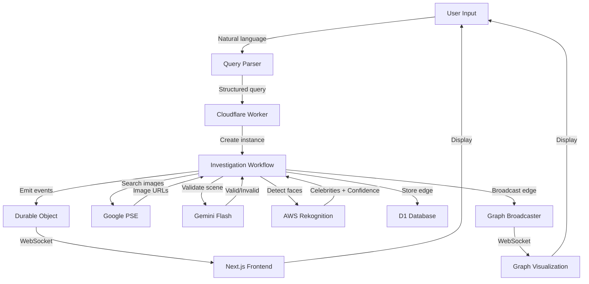
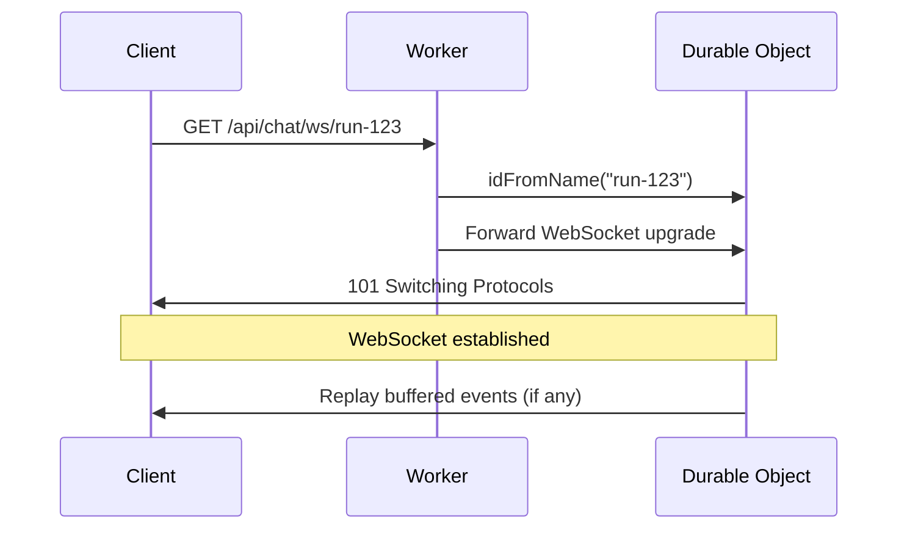

This page traces the complete journey of data through the Connected system, from user input to verified visual connections. Understanding these flows is essential for debugging, optimization, and extending the platform.

## High-Level Flow



## Flow 1: Query Submission

### Step 1: User Input

**Location**: `apps/web/src/components/investigation-app.tsx`

User types in chat interface:
```
"Is Elon Musk connected to Beyonce?"
```

### Step 2: Natural Language Parsing

**Endpoint**: `POST /api/chat/parse`
**Handler**: `apps/worker/src/index.ts:166-196`

```typescript
const client = new OpenRouterClient({
  apiKey: env.OPENROUTER_API_KEY,
  model: "google/gemini-2.0-flash-001",
});

const result = await client.parseQuery(query);
// Returns: { personA: "Elon Musk", personB: "Beyonce", isValid: true }
```

**Data Shape**:
```typescript
interface ParsedQuery {
  isValid: boolean;
  personA: string | null;
  personB: string | null;
  reason?: string; // If invalid
}
```

### Step 3: Investigation Creation

**Endpoint**: `POST /api/chat/query`
**Handler**: `apps/worker/src/index.ts:198-264`

```typescript
// Check rate limit
const clientIP = getClientIP(request);
const rateLimit = await checkRateLimit(env, clientIP);

if (!rateLimit.allowed) {
  return Response.json({ error: "Rate limit exceeded" }, { status: 429 });
}

// Generate unique run ID
const runId = crypto.randomUUID();

// Create workflow instance
const instance = await env.INVESTIGATION_WORKFLOW.create({
  params: { personA, personB, runId }
});

return Response.json({
  id: instance.id,
  runId,
  status: "started",
  personA,
  personB,
});
```

**Data Shape**:
```typescript
interface InvestigationStartResponse {
  id: string;          // Workflow instance ID
  runId: string;       // UUID for event stream
  status: "started";
  personA: string;
  personB: string;
}
```

### Step 4: WebSocket Connection

**Endpoint**: `GET /api/chat/ws/:runId`
**Handler**: `apps/worker/src/index.ts:143-163`

```typescript
// Route to per-runId Durable Object
const id = env.INVESTIGATION_EVENTS_BROADCASTER.idFromName(runId);
const stub = env.INVESTIGATION_EVENTS_BROADCASTER.get(id);
return stub.fetch(new Request("https://internal/ws", request));
```

**Connection Flow**:


## Flow 2: Investigation Execution

### Step 1: Direct Connection Check

**Location**: `apps/worker/src/workflows/investigation.ts:320-508`

#### 2.1: Image Search

```typescript
const query = directQuery(personA, personB); // "Elon Musk Beyonce"
trackSubrequest(); // Increment counter

const searchRes = await searchImages({ query });
// Returns: { query, results: ImageSearchResult[] }
```

**Google PSE Request**:
```http
GET https://www.googleapis.com/customsearch/v1
  ?key={GOOGLE_API_KEY}
  &cx={GOOGLE_CX}
  &q=Elon+Musk+Beyonce
  &searchType=image
  &num=5
```

**Response Data**:
```typescript
interface ImageSearchResult {
  imageUrl: string;      // "https://example.com/photo.jpg"
  thumbnailUrl: string;  // "https://example.com/thumb.jpg"
  contextUrl: string;    // "https://example.com/article"
  title: string;         // "Elon and Beyonce at gala"
}
```

#### 2.2: Scene Validation

```typescript
trackSubrequest();
const visual = await verifyCopresence({ imageUrl: img.imageUrl });
// Uses Gemini Flash to detect collages/montages
```

**Gemini Request**:
```typescript
POST https://generativelanguage.googleapis.com/v1/models/gemini-2.0-flash:generateContent
{
  "contents": [{
    "parts": [
      { "text": "Is this a real scene or a collage? Respond with JSON." },
      { "inline_data": { "mime_type": "image/jpeg", "data": "<base64>" } }
    ]
  }]
}
```

**Response Data**:
```typescript
interface CopresenceResult {
  isValidScene: boolean;
  reason: string; // "Real photograph" or "Digital collage detected"
}
```

#### 2.3: Celebrity Detection

```typescript
if (visual.isValidScene) {
  trackSubrequest();
  const analysis = await detectCelebrities({ imageUrl: img.imageUrl });
}
```

**AWS Rekognition Request**:
```typescript
const command = new RecognizeCelebritiesCommand({
  Image: { Bytes: imageBuffer }
});
const response = await rekognitionClient.send(command);
```

**Response Data**:
```typescript
interface ImageAnalysisResult {
  imageUrl: string;
  celebrities: DetectedCelebrity[];  // [{ name, confidence, boundingBox }]
}
```

#### 2.4: Evidence Validation

```typescript
if (isValidEvidence(analysis.celebrities, personA, personB, 80)) {
  const record = createEvidenceRecord(img, analysis, personA, personB);
  evidence.push(record);
  break; // Early exit - evidence found!
}
```

**Evidence Record**:
```typescript
interface EvidenceRecord {
  from: "Elon Musk";
  to: "Beyonce";
  imageUrl: "https://...";
  thumbnailUrl: "https://...";
  contextUrl: "https://...";
  title: "...";
  detectedCelebs: [
    { name: "Elon Musk", confidence: 92.5 },
    { name: "Beyoncé", confidence: 87.3 }
  ];
  imageScore: 87.3; // min(92.5, 87.3)
}
```

#### 2.5: Edge Creation

```typescript
if (evidence.length > 0) {
  const edge = createVerifiedEdge(personA, personB, evidence);
  // Returns: { from, to, edgeConfidence: 87.3, evidence, bestEvidence }
}
```

### Step 2: Event Broadcasting

**Location**: `apps/worker/src/workflows/investigation.ts:55-160`

```typescript
const eventId = `${runId}:${String(eventIndex).padStart(6, "0")}`;

const event: InvestigationEvent = {
  type: "evidence",
  runId,
  timestamp: new Date().toISOString(),
  message: `Found direct evidence: Elon Musk ↔ Beyonce`,
  data: {
    eventId,
    edge: {
      from: "Elon Musk",
      to: "Beyonce",
      confidence: 87.3,
      evidenceUrl: "https://...",
      thumbnailUrl: "https://..."
    }
  }
};

// Emit to Durable Object
const doId = env.INVESTIGATION_EVENTS_BROADCASTER.idFromName(runId);
const stub = env.INVESTIGATION_EVENTS_BROADCASTER.get(doId);
await stub.fetch(new Request("https://internal/emit", {
  method: "POST",
  body: JSON.stringify(event),
}));
```

**Durable Object Processing**:
```typescript
// apps/worker/src/durable-objects/investigation-events-broadcaster.ts:82-126
async handleEmit(request: Request) {
  const event = await request.json();
  
  // Store event
  const index = this.eventIndex++;
  await this.ctx.storage.put(`event:${index}`, { event, index });
  await this.ctx.storage.put("eventIndex", this.eventIndex);
  
  // Broadcast to all WebSocket clients
  const message = JSON.stringify({
    type: "event",
    data: event,
    index,
  });
  
  const sockets = this.ctx.getWebSockets();
  for (const ws of sockets) {
    ws.send(message);
  }
}
```

### Step 3: Graph Persistence

**Location**: `apps/worker/src/workflows/investigation.ts:471-493`

```typescript
// Persist edge to D1
await upsertEdge(
  env.GRAPH_DB,
  "Elon Musk",
  "Beyonce",
  87.3,
  "https://...", // evidenceUrl
  "https://...", // thumbnailUrl
  "https://..."  // contextUrl
);

// Broadcast to graph visualization
await this.broadcastEdge({
  source: "Elon Musk",
  target: "Beyonce",
  confidence: 87.3,
  evidenceUrl: "https://...",
  thumbnailUrl: "https://...",
  contextUrl: "https://..."
});
```

**D1 Operations**:
```typescript
// apps/worker/src/graph-db.ts
export async function upsertEdge(db: D1Database, from: string, to: string, ...) {
  // Get or create nodes
  const sourceNode = await getOrCreateNode(db, from);
  const targetNode = await getOrCreateNode(db, to);
  
  // Upsert edge (keep highest confidence if duplicate)
  await db.prepare(`
    INSERT INTO edges (source_id, target_id, confidence, evidence_url, thumbnail_url, context_url)
    VALUES (?, ?, ?, ?, ?, ?)
    ON CONFLICT (source_id, target_id) DO UPDATE SET
      confidence = MAX(confidence, excluded.confidence),
      evidence_url = excluded.evidence_url
  `).bind(sourceNode.id, targetNode.id, confidence, evidenceUrl, thumbnailUrl, contextUrl).run();
}
```

**Graph Broadcast**:
```typescript
// Broadcast to GraphBroadcaster Durable Object
const id = env.GRAPH_BROADCASTER.idFromName("global");
const stub = env.GRAPH_BROADCASTER.get(id);
await stub.fetch(new Request("https://internal/broadcast", {
  method: "POST",
  body: JSON.stringify({
    source: "Elon Musk",
    target: "Beyonce",
    confidence: 87.3,
    evidenceUrl: "..."
  })
}));
```

## Flow 3: Bridge Discovery

When no direct connection exists, the workflow enters bridge discovery mode.

### Step 1: LLM Bridge Suggestion

```typescript
const bridges = await planner.suggestBridgeCandidates(
  "Elon Musk",
  "Beyonce",
  ["already-tried-person"]
);
```

**OpenRouter Request**:
```typescript
POST https://openrouter.ai/api/v1/chat/completions
{
  "model": "google/gemini-2.0-flash-001",
  "messages": [{
    "role": "user",
    "content": "Suggest 5 bridge candidates between Elon Musk and Beyonce..."
  }],
  "response_format": { "type": "json_object" }
}
```

**Response Data**:
```typescript
interface BridgeCandidate {
  name: string;       // "Grimes"
  confidence: number; // 85
  reasoning: string;  // "Canadian musician, dated Elon, collaborates with artists"
}
```

### Step 2: Candidate Verification Loop

```typescript
for (const candidate of candidatesToTry) {
  // Step 3: Verify Bridge
  const edgeToCandidate = await step.do(`verify-${candidate}`, async () => {
    // Same flow as direct check
    const queries = verificationQueries(currentFrontier, candidate);
    for (const query of queries) {
      const searchRes = await searchImages({ query });
      // ... validate, detect, verify
    }
  });
  
  if (edgeToCandidate) {
    // Push to DFS stack
    state.path.push(candidate);
    state.verifiedEdges.push(edgeToCandidate);
    
    // Step 4: Connect Target
    const bridgeEdge = await step.do(`bridge-${candidate}`, async () => {
      // Try to connect candidate to target
    });
    
    if (bridgeEdge) {
      // SUCCESS!
      return finalizeSuccess(state);
    }
    
    // Continue DFS from new frontier
  }
}
```

## Flow 4: Result Delivery

### Step 1: Final Event

```typescript
const result: VerifiedPath = {
  personA: "Elon Musk",
  personB: "Beyonce",
  path: ["Elon Musk", "Grimes", "Jay-Z", "Beyonce"],
  edges: [
    { from: "Elon Musk", to: "Grimes", edgeConfidence: 92, ... },
    { from: "Grimes", to: "Jay-Z", edgeConfidence: 85, ... },
    { from: "Jay-Z", to: "Beyonce", edgeConfidence: 95, ... }
  ],
  confidence: {
    pathBottleneck: 85,  // min(92, 85, 95)
    pathCumulative: 0.74 // 0.92 * 0.85 * 0.95
  }
};

await emit("final", "Investigation complete! Found 3-hop connection", {
  result
});
```

### Step 2: Frontend Processing

**Location**: `apps/web/src/components/investigation-app.tsx`

```typescript
// WebSocket message handler
webSocket.onmessage = (event) => {
  const message = JSON.parse(event.data);
  
  if (message.type === "event" && message.data.type === "final") {
    const result = message.data.data.result;
    
    // Update chat messages
    setMessages(prev => [...prev, {
      role: "assistant",
      content: `Found path: ${result.path.join(" → ")}`,
      metadata: { result }
    }]);
    
    // Update graph visualization
    updateGraph(result.edges);
  }
};
```

### Step 3: Graph Visualization

**Location**: `apps/web/src/components/social-graph.tsx`

```typescript
function updateGraph(edges: VerifiedEdge[]) {
  edges.forEach(edge => {
    // Add nodes
    if (!graph.hasNode(edge.from)) {
      graph.addNode(edge.from, {
        label: edge.from,
        size: 15,
        color: '#3b82f6'
      });
    }
    if (!graph.hasNode(edge.to)) {
      graph.addNode(edge.to, {
        label: edge.to,
        size: 15,
        color: '#3b82f6'
      });
    }
    
    // Add edge
    graph.addEdge(edge.from, edge.to, {
      size: edge.edgeConfidence / 20,
      color: '#94a3b8',
      label: `${Math.round(edge.edgeConfidence)}%`
    });
  });
  
  // Run force-directed layout
  forceAtlas2.assign(graph, { iterations: 100 });
}
```

## Data Persistence

### KV Storage

**Namespace**: `INVESTIGATION_EVENTS`
**TTL**: 1 hour

```typescript
// Event storage (fallback for SSE)
Key: "run-123:000000" → Value: JSON.stringify(event)
Key: "run-123:000001" → Value: JSON.stringify(event)
Key: "run-123:count" → Value: "2"

// Rate limiting
Key: "ratelimit:192.168.1.1" → Value: JSON.stringify({ count: 5, resetAt: 1234567890 })
```

### D1 Database

**Tables**: `nodes`, `edges`

```sql
-- Example data
SELECT * FROM nodes;
-- id | name         | created_at
-- 1  | Elon Musk    | 2024-03-04 10:00:00
-- 2  | Beyonce      | 2024-03-04 10:00:15
-- 3  | Grimes       | 2024-03-04 10:01:23

SELECT * FROM edges;
-- id | source_id | target_id | confidence | evidence_url | created_at
-- 1  | 1         | 3         | 92.0       | https://...  | 2024-03-04 10:01:23
-- 2  | 3         | 2         | 85.0       | https://...  | 2024-03-04 10:02:45
```

### Durable Object Storage

**Per-Investigation Events**:
```typescript
// InvestigationEventsBroadcaster storage
"eventIndex" → 42
"isComplete" → true
"event:0" → { event: {...}, index: 0 }
"event:1" → { event: {...}, index: 1 }
// ... up to event:41
```

## Error Handling

### External API Failures

```typescript
try {
  const searchRes = await searchImages({ query });
} catch (error) {
  // Workflow retries automatically
  // If retry fails, emit error event
  await emit("image_result", `Error - ${error.message}`, {
    status: "error",
    reason: error.message
  });
  continue; // Try next image
}
```

### Rate Limit Handling

```typescript
if (count >= RATE_LIMIT_MAX) {
  return Response.json(
    { 
      error: "Rate limit exceeded. You can perform 50 searches per day.",
      remaining: 0,
      resetAt: new Date(resetAt * 1000).toISOString()
    },
    { status: 429 }
  );
}
```

### Budget Exhaustion

```typescript
if (!checkBudget()) {
  await emit("status", "Budget exhausted, stopping search", {
    budget: state.budgets
  });
  
  return {
    status: "no_path",
    message: `Budget exhausted (${state.budgets.stepsUsed} steps used)`
  };
}
```

## Performance Metrics

### Typical Investigation Timeline

```
0ms     - User submits query
50ms    - Worker creates workflow
100ms   - WebSocket connected
200ms   - First image search starts
500ms   - Direct check complete (no evidence)
1000ms  - LLM suggests bridge candidates
2000ms  - First bridge verification starts
3500ms  - Bridge verified, trying to connect to target
5000ms  - Final connection verified
5100ms  - Results delivered to frontend
```

### Subrequest Budget Breakdown

```
Direct Check (3 images):
- 1 Google PSE search
- 3 Gemini validations
- 3 Rekognition detections
- 3 Gemini AI verifications (fallback)
= 10 subrequests

Bridge Discovery:
- 1 LLM bridge suggestion
- 3 Google PSE searches (verification queries)
- 9 Gemini validations (3 per query)
- 9 Rekognition detections
- 9 Gemini AI verifications
= 31 subrequests per candidate

Total for 2-hop path (1 bridge):
10 (direct) + 31 (bridge) + 31 (target) = 72 subrequests
```

## Optimization Opportunities

1. **Image Caching**: Cache Rekognition results for popular figures
2. **Bridge Precomputation**: Pre-compute common bridges (e.g., Bill Gates connects many tech founders)
3. **Query Batching**: Process multiple images in parallel (careful with budget)
4. **LLM Caching**: Cache bridge suggestions for common person pairs
5. **D1 Indexing**: Add indexes on frequently queried columns