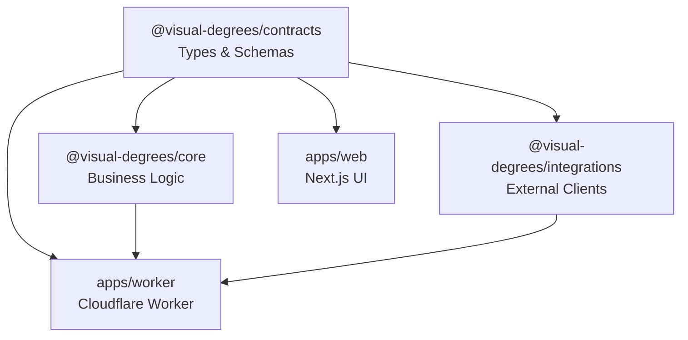

Connected uses a **pnpm workspace monorepo** to organize code into reusable packages and deployable applications. This structure enables code sharing, type safety, and independent deployment.

## Repository Layout

```
cf_ai_connected/
├── apps/
│   ├── web/                    # Next.js chat UI
│   └── worker/                 # Cloudflare Worker
├── packages/
│   ├── contracts/              # Shared TypeScript types
│   ├── core/                   # Investigation logic
│   └── integrations/           # External API clients
├── docs/
│   └── context/                # Architecture documentation
├── scripts/
│   └── test-pipeline.ts        # Local testing scripts
├── package.json                # Root workspace config
├── pnpm-workspace.yaml         # Workspace definition
└── tsconfig.json               # Base TypeScript config
```

## Apps Directory

### apps/web - Next.js Frontend

**Purpose**: User-facing chat interface and graph visualization

**Key Technologies**:
- Next.js 15 with App Router
- React 18 with Server Components
- Tailwind CSS 4 for styling
- Sigma.js for graph rendering
- Radix UI for accessible components

**Package Structure**:
```
apps/web/
├── src/
│   ├── app/                   # Next.js app router
│   │   ├── page.tsx          # Home page
│   │   └── layout.tsx        # Root layout
│   ├── components/           # React components
│   │   ├── investigation-app.tsx  # Main investigation UI
│   │   ├── social-graph.tsx       # Graph visualization
│   │   └── ui/                    # Reusable UI components
│   ├── hooks/                # Custom React hooks
│   └── lib/                  # Utilities
├── public/                   # Static assets
├── package.json
└── next.config.js
```

**Dependencies**:
```json
{
  "dependencies": {
    "next": "15.5.9",
    "react": "18.3.1",
    "@react-sigma/core": "^5.0.6",
    "sigma": "^3.0.2",
    "graphology": "^0.26.0",
    "@radix-ui/react-dialog": "^1.1.15",
    "tailwindcss": "^4"
  }
}
```

**Deployment**:
- Platform: Cloudflare Pages
- Build: `npm run build:worker` (OpenNext adapter)
- Deploy: `npm run deploy`

### apps/worker - Cloudflare Worker

**Purpose**: Edge-native API orchestration and investigation engine

**Key Technologies**:
- Cloudflare Workers (Hono framework)
- Cloudflare Workflows
- Durable Objects
- D1 Database

**Package Structure**:
```
apps/worker/
├── src/
│   ├── index.ts              # Worker entry point (API routes)
│   ├── workflows/
│   │   └── investigation.ts  # InvestigationWorkflow class
│   ├── durable-objects/
│   │   ├── graph-broadcaster.ts              # Global graph updates
│   │   └── investigation-events-broadcaster.ts  # Per-run events
│   ├── tools/
│   │   ├── search.ts         # Google PSE integration
│   │   ├── detect.ts         # AWS Rekognition
│   │   ├── verify.ts         # Scene validation
│   │   └── verify-celebrities.ts  # AI verification
│   ├── graph-db.ts           # D1 database operations
│   └── env.d.ts              # Environment types
├── wrangler.toml             # Cloudflare configuration
└── package.json
```

**Dependencies**:
```json
{
  "dependencies": {
    "@visual-degrees/contracts": "workspace:*",
    "@visual-degrees/core": "workspace:*",
    "@visual-degrees/integrations": "workspace:*",
    "hono": "^3.12.0"
  }
}
```

**Key Files**:

#### src/index.ts (408 lines)
- HTTP request routing
- Rate limiting logic
- CORS handling
- Workflow instance creation
- WebSocket upgrades

#### src/workflows/investigation.ts (1400+ lines)
- `InvestigationWorkflow` class
- DFS-based path finding
- Event emitter for real-time updates
- Budget tracking
- Backtracking logic

#### src/durable-objects/investigation-events-broadcaster.ts
- Per-investigation WebSocket hub
- Event buffering and replay
- Hibernation support

## Packages Directory

### packages/contracts - Shared Types

**Purpose**: TypeScript interfaces and types shared across all packages

**Exports**:
```typescript
// Image search types
export interface ImageSearchResult {
  imageUrl: string;
  thumbnailUrl: string;
  contextUrl: string;
  title: string;
}

// Celebrity detection types
export interface DetectedCelebrity {
  name: string;
  confidence: number;
  boundingBox: BoundingBox;
}

// Evidence types
export interface EvidenceRecord {
  from: string;
  to: string;
  imageUrl: string;
  detectedCelebs: Array<{ name: string; confidence: number }>;
  imageScore: number;
}

export interface VerifiedEdge {
  from: string;
  to: string;
  edgeConfidence: number;
  evidence: EvidenceRecord[];
  bestEvidence: EvidenceRecord;
}

// Investigation state
export interface InvestigationState {
  personA: string;
  personB: string;
  frontier: string;
  hopDepth: number;
  path: string[];
  verifiedEdges: VerifiedEdge[];
  budgets: InvestigationBudgets;
  status: "running" | "success" | "no_path";
}

// Configuration
export interface InvestigationConfig {
  hopLimit: number;              // Default: 15
  confidenceThreshold: number;   // Default: 80
  imagesPerQuery: number;        // Default: 3
}

// Event types for streaming
export type InvestigationEventType =
  | "status" | "thinking" | "step_start" | "step_update" | "step_complete"
  | "image_result" | "evidence" | "path_update" | "backtrack"
  | "final" | "no_path" | "error";

export interface InvestigationEvent {
  type: InvestigationEventType;
  runId: string;
  timestamp: string;
  message: string;
  data?: Record<string, any>;
}
```

**Package Configuration**:
```json
{
  "name": "@visual-degrees/contracts",
  "version": "0.1.0",
  "private": true,
  "type": "module",
  "main": "./src/index.ts",
  "exports": {
    ".": "./src/index.ts"
  }
}
```

### packages/core - Investigation Logic

**Purpose**: Pure business logic for path-finding and evidence validation

**Exports**:
```typescript
// Query generation
export function directQuery(personA: string, personB: string): string;
export function verificationQueries(from: string, to: string): string[];
export function bridgeQueries(from: string, to: string): string[];

// Evidence validation
export function isValidEvidence(
  celebrities: DetectedCelebrity[],
  personA: string,
  personB: string,
  threshold: number
): boolean;

export function createEvidenceRecord(
  image: ImageSearchResult,
  analysis: ImageAnalysisResult,
  from: string,
  to: string
): EvidenceRecord | null;

export function createVerifiedEdge(
  from: string,
  to: string,
  evidence: EvidenceRecord[]
): VerifiedEdge;

// Confidence scoring
export function calculatePathConfidence(
  edges: VerifiedEdge[]
): PathConfidence;

// Name matching
export function namesMatch(nameA: string, nameB: string): boolean;
```

**Dependencies**:
```json
{
  "dependencies": {
    "@visual-degrees/contracts": "workspace:*"
  }
}
```

**Key Files**:
- `src/orchestrator.ts`: Evidence validation logic
- `src/query-templates.ts`: Search query generation
- `src/confidence.ts`: Confidence calculation algorithms

### packages/integrations - External API Clients

**Purpose**: Type-safe wrappers for external services

**Exports**:
```typescript
// Google Programmable Search Engine
export class GooglePSEClient {
  async search(query: string): Promise<ImageSearchResponse>;
}

// AWS Rekognition
export class CelebrityRekognitionClient {
  constructor(config: { region: string; accessKeyId: string; secretAccessKey: string });
  async detectCelebrities(imageUrl: string): Promise<ImageAnalysisResult>;
}

// OpenRouter (Gemini Flash)
export class OpenRouterClient {
  constructor(config: { apiKey: string; model: string });
  async parseQuery(query: string): Promise<ParsedQuery>;
  async suggestBridgeCandidates(
    from: string,
    to: string,
    exclude?: string[]
  ): Promise<BridgeCandidate[]>;
  async selectNextExpansion(state: SelectionInput): Promise<SelectionPlan>;
}

// Cloudflare Workers AI (fallback)
export class WorkersAIPlannerClient {
  constructor(ai: Ai);
  async suggestBridgeCandidates(
    from: string,
    to: string,
    exclude?: string[]
  ): Promise<BridgeCandidate[]>;
}

// Gemini API (direct)
export class GeminiClient {
  async verifyCopresence(imageUrl: string): Promise<{
    isValidScene: boolean;
    reason: string;
  }>;
  async verifyCelebrities(
    imageUrl: string,
    personA: string,
    personB: string
  ): Promise<CelebrityVerificationResult>;
}
```

**Dependencies**:
```json
{
  "dependencies": {
    "@aws-sdk/client-rekognition": "^3.478.0",
    "@cloudflare/ai-utils": "^1.0.1",
    "@visual-degrees/contracts": "workspace:*"
  }
}
```

**Key Files**:
- `src/google-pse/client.ts`: Image search
- `src/rekognition/client.ts`: Face detection
- `src/openrouter/client.ts`: LLM planning
- `src/gemini/client.ts`: Visual validation
- `src/workers-ai/client.ts`: Cloudflare AI fallback

## Dependency Graph



**Dependency Rules**:
1. `contracts` has no dependencies (base layer)
2. `core` depends only on `contracts`
3. `integrations` depends only on `contracts`
4. `worker` depends on all packages
5. `web` depends only on `contracts` (types for API responses)

## Workspace Configuration

### pnpm-workspace.yaml

```yaml
packages:
  - 'apps/*'
  - 'packages/*'
```

### Root package.json

```json
{
  "name": "visual-degrees",
  "version": "0.1.0",
  "private": true,
  "type": "module",
  "scripts": {
    "build": "pnpm -r build",
    "test:pipeline": "tsx scripts/test-pipeline.ts",
    "typecheck": "tsc --noEmit"
  },
  "engines": {
    "node": ">=18"
  }
}
```

### TypeScript Configuration

Each package has its own `tsconfig.json` that extends the root:

```json
// packages/contracts/tsconfig.json
{
  "extends": "../../tsconfig.json",
  "compilerOptions": {
    "outDir": "./dist",
    "rootDir": "./src"
  },
  "include": ["src/**/*"]
}
```

## Build Process

### Development

```bash
# Install dependencies
pnpm install

# Build all packages
pnpm build

# Start worker (development mode)
cd apps/worker
pnpm dev

# Start web app (separate terminal)
cd apps/web
pnpm dev
```

### Production

```bash
# Build all packages
pnpm build

# Deploy worker
cd apps/worker
pnpm deploy

# Deploy web app
cd apps/web
pnpm deploy
```

## Code Sharing Benefits

1. **Type Safety**: Frontend and backend share exact same types
2. **Code Reuse**: Business logic in `core` used by Worker
3. **Testability**: Pure functions in `core` easy to unit test
4. **Modularity**: External services isolated in `integrations`
5. **Fast Iteration**: Workspace protocol for instant updates

## Adding a New Package

1. Create directory: `packages/new-package/`
2. Add `package.json`:
   ```json
   {
     "name": "@visual-degrees/new-package",
     "version": "0.1.0",
     "private": true,
     "main": "./src/index.ts",
     "exports": {
       ".": "./src/index.ts"
     }
   }
   ```
3. Add to workspace: Already included via `packages/*`
4. Reference in other packages: `"@visual-degrees/new-package": "workspace:*"`
5. Run `pnpm install`

## Best Practices

1. **Keep packages focused**: Each package should have a single responsibility
2. **Avoid circular dependencies**: Contracts as base layer prevents cycles
3. **Export through index**: Always use `src/index.ts` as entry point
4. **Use workspace protocol**: `workspace:*` for local package versions
5. **Type everything**: Leverage TypeScript for cross-package type safety
6. **Document exports**: Add JSDoc comments to public APIs