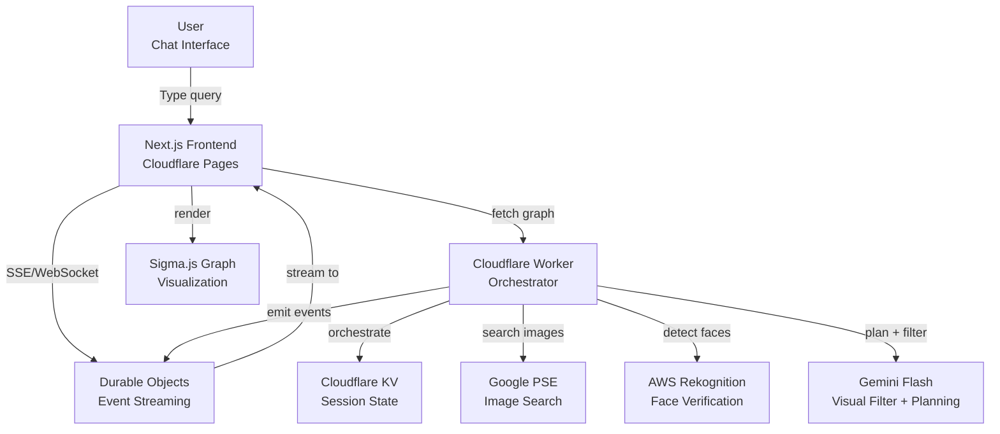
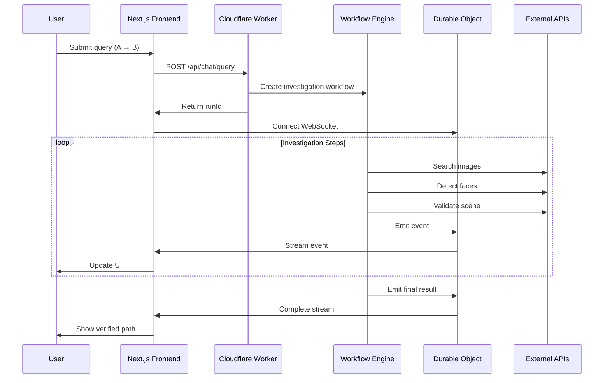
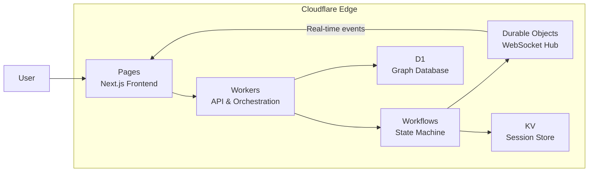

Connected is a serverless AI-powered investigation system built entirely on Cloudflare's edge computing platform. It finds verified visual connections between public figures using real-time image search, celebrity face verification, and AI-guided reasoning.

## System Architecture

The platform uses a distributed, event-driven architecture that runs at the edge:

## Core Components

### Frontend Layer
- **Next.js 15 Application**: Server-rendered React app hosted on Cloudflare Pages
- **Real-time Chat UI**: Streaming investigation progress via WebSocket/SSE
- **Sigma.js Graph Visualization**: Interactive force-directed graph of verified connections
- **Radix UI Components**: Accessible, customizable UI primitives

### Backend Layer
- **Cloudflare Workers**: Edge-native serverless API handling all HTTP requests
- **Cloudflare Workflows**: Durable execution engine for multi-step investigation state machine
- **Durable Objects**: Stateful isolates for WebSocket broadcasting and event management
- **KV Storage**: Global key-value store for rate limiting and session caching
- **D1 Database**: Persistent SQLite storage for the social graph

### External Services
- **Google Programmable Search Engine**: Finding candidate images of public figures
- **AWS Rekognition**: Celebrity face detection with confidence scoring
- **Gemini 2.0 Flash**: Visual scene validation and strategic bridge candidate selection

## Key Design Principles

### 1. Edge-First Architecture
All computation happens at Cloudflare's edge, within 50ms of users globally:
- Sub-50ms cold starts for Workers
- Automatic geographic distribution
- No infrastructure management

### 2. Evidence-Based Verification
Every connection requires visual proof:
- ≥80% confidence threshold for face detection
- Real scenes only (collages filtered via AI)
- Multiple evidence sources per edge

### 3. Durable Execution
Investigations can run for minutes without timing out:
- Workflows handle retries automatically
- State persists across subrequest limits
- Budget tracking prevents infinite loops

### 4. Real-Time Streaming
Users see progress as it happens:
- WebSocket connections via Durable Objects
- Event buffering for late joiners
- Hibernatable connections for efficiency

## Data Flow

## Technology Stack

| Layer | Technology | Purpose |
|-------|------------|----------|
| **Frontend** | Next.js 15 + React 18 | Server-rendered UI with streaming |
| **Styling** | Tailwind CSS 4 + Radix UI | Utility-first styling + accessible components |
| **Graph** | Sigma.js + Graphology | Force-directed network visualization |
| **Backend** | Cloudflare Workers | Edge-native serverless compute |
| **Orchestration** | Cloudflare Workflows | Durable state machine execution |
| **Real-time** | Durable Objects | Stateful WebSocket broadcasting |
| **State** | KV + D1 | Session caching + graph persistence |
| **Image Search** | Google PSE | Public figure photo discovery |
| **Face Detection** | AWS Rekognition | Celebrity identification (80%+ confidence) |
| **Visual AI** | Gemini 2.0 Flash | Scene validation + strategic planning |
| **Package Manager** | pnpm | Fast, disk-efficient monorepo management |

## Performance Characteristics

- **Cold Start**: &lt;50ms for Worker initialization
- **API Latency**: &lt;100ms for simple queries at edge
- **Investigation Time**: 30 seconds - 5 minutes (depends on path complexity)
- **Concurrent Users**: Unlimited (auto-scaling at edge)
- **Cost Model**: Pay-per-request (no idle costs)

## Security & Rate Limiting

- **Rate Limits**: 50 investigations per IP per day
- **CORS**: Configurable allowed origins
- **IP Whitelisting**: Bypass limits for trusted IPs
- **No Authentication**: Public demo (auth can be added)

## Deployment Model

### Why Cloudflare?

- **Zero infrastructure management**: No servers to provision or scale
- **Global by default**: Code runs in 300+ locations worldwide
- **Cost efficient**: Pay only for what you use, generous free tier
- **Integrated ecosystem**: Workers, KV, Durable Objects, Workflows, and D1 work seamlessly together
- **Instant deployments**: Git push → production in seconds

## Next Steps

<CardGroup cols={2}>
  <Card title="Cloudflare Stack" icon="cloud" href="/architecture/cloudflare-stack">
    Deep dive into Workers, Workflows, Durable Objects, KV, and D1
  </Card>
  <Card title="Monorepo Structure" icon="folder-tree" href="/architecture/monorepo-structure">
    Understand the workspace organization and package dependencies
  </Card>
  <Card title="State Machine" icon="diagram-project" href="/architecture/state-machine">
    Learn how the investigation workflow operates
  </Card>
  <Card title="Data Flow" icon="arrow-right-arrow-left" href="/architecture/data-flow">
    Trace how data moves from query to verified result
  </Card>
</CardGroup>