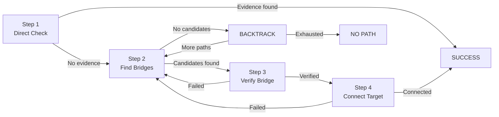
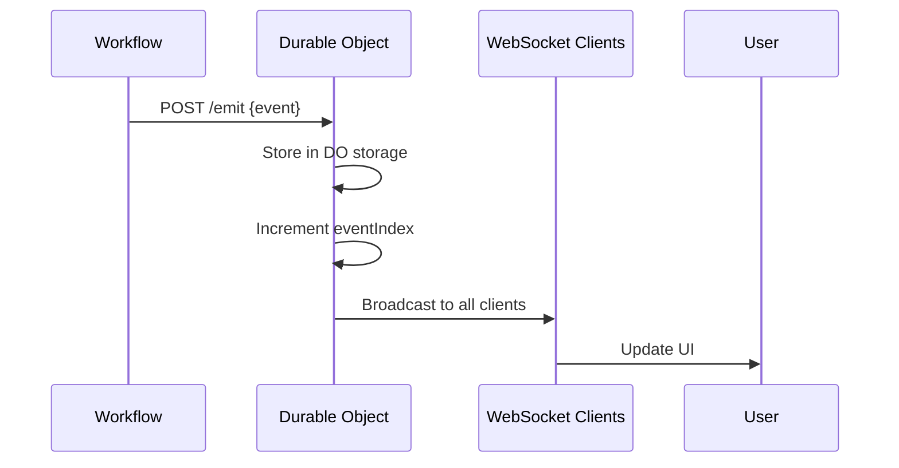

The investigation engine uses a **Depth-First Search (DFS) algorithm** implemented as a Cloudflare Workflow to find verified visual connections between public figures. The workflow progresses through distinct phases, tracking state and emitting real-time events.

## Workflow Phases

The investigation follows a 4-step progression:



### Step 1: Direct Check

**Goal**: Check if Person A and Person B appear together in any image

**Process**:
1. Generate search query: `"Person A Person B"`
2. Fetch images from Google PSE (top 3-5 results)
3. For each image:
   - Validate scene with Gemini (reject collages)
   - Detect celebrities with AWS Rekognition
   - Check if both people detected with ≥80% confidence
   - If Rekognition fails, try AI verification as fallback
4. If evidence found, return success immediately
5. Otherwise, proceed to Step 2

**Event Stream**:
```
step_start → "Checking for direct connection: A ↔ B"
step_update → "Searching for 'A B' images..."
image_result → "[1] Collage - detected..."
image_result → "[2] ✓ Evidence - A & B"
step_complete → "Direct connection verified with 92% confidence!"
final → "Investigation complete!"
```

### Step 2: Find Bridges

**Goal**: Identify potential intermediary people who might connect to both A and B

**Process**:
1. Ask LLM for bridge candidates: `suggestBridgeCandidates(from, to, excludeList)`
2. LLM returns ranked list based on:
   - Shared industries (tech, entertainment, politics)
   - Geographic overlap (Silicon Valley, Hollywood)
   - Public event participation (conferences, galas)
   - Social circles (board memberships, foundations)
3. Filter out already-tried candidates
4. Use LLM to select best candidates to try: `selectNextExpansion(state)`
5. Proceed to Step 3 with candidate list

**Event Stream**:
```
step_start → "Finding bridge candidates from A"
step_update → "AI suggested 5 bridge candidates"
step_complete → "Will try 5 candidates: C, D, E..."
```

**LLM Prompt (simplified)**:
```
Given:
- Start: {from}
- Target: {to}
- Already tried: {excludeList}

Suggest 5 bridge candidates who:
1. Have strong connections to {from}
2. Could plausibly connect to {to}
3. Are public figures with many photos

Respond with JSON array:
[
  { "name": "...", "confidence": 85, "reasoning": "..." }
]
```

### Step 3: Verify Bridge

**Goal**: Find visual evidence of connection between current frontier and candidate

**Process**:
1. Generate verification queries:
   - `"Person A Candidate"`
   - `"Candidate Person A"`
   - `"Person A Candidate event"`
2. For each query:
   - Fetch images from Google PSE
   - Validate scenes with Gemini
   - Detect celebrities with Rekognition
   - Check for both people with ≥80% confidence
3. If evidence found:
   - Create verified edge
   - Push to DFS stack
   - Update path: `[A] → [A, Candidate]`
   - Proceed to Step 4
4. If no evidence:
   - Mark candidate as failed
   - Try next candidate from Step 2

**Event Stream**:
```
step_start → "Verifying: A ↔ C"
step_update → "Searching for 'A C' images..."
image_result → "[1] No match"
image_result → "[2] ✓ Evidence - A & C"
evidence → "Verified: A ↔ C"
step_complete → "Connection verified with 88% confidence"
path_update → "Path updated: A → C"
```

### Step 4: Connect Target

**Goal**: Check if current bridge candidate connects directly to Person B

**Process**:
1. Generate bridge queries:
   - `"Candidate Person B"`
   - `"Person B Candidate"`
   - `"Candidate Person B photo"`
2. Search for visual evidence (same as Step 3)
3. If evidence found:
   - Create verified edge
   - Complete path: `[A, Candidate] → [A, Candidate, B]`
   - Return success
4. If no evidence:
   - Continue DFS from new frontier (Candidate)
   - Return to Step 2 with frontier = Candidate

**Event Stream**:
```
step_start → "Connecting: C ↔ B"
step_update → "Searching for 'C B' images..."
image_result → "[1] ✓ Evidence - C & B"
evidence → "Verified final hop: C ↔ B"
step_complete → "Connection to B verified!"
path_update → "Path complete: A → C → B"
final → "Investigation complete! Found 2-hop connection with 85% confidence."
```

## DFS Algorithm

### Stack Frame Structure

```typescript
interface DFSStackFrame {
  frontier: string;           // Current person we're exploring from
  candidates: string[];       // List of bridge candidates to try
  candidateIndex: number;     // Current position in candidates array
  edge: VerifiedEdge | null;  // Edge that led to this frontier
}
```

### Stack Operations

#### Push (Moving Forward)

When a bridge candidate is verified:

```typescript
const frame: DFSStackFrame = {
  frontier: currentFrontier,      // "A"
  candidates: ["C", "D", "E"],    // All candidates at this level
  candidateIndex: 0,               // We verified "C"
  edge: edgeToCandidate            // A ↔ C edge
};

dfsStack.push(frame);
state.path.push("C");              // Path: [A, C]
state.frontier = "C";              // New frontier
```

#### Pop (Backtracking)

When no more candidates at current level:

```typescript
const poppedFrame = dfsStack.pop();

// Restore state
state.path.pop();                  // Path: [A, C] → [A]
state.verifiedEdges.pop();         // Remove A ↔ C
state.frontier = dfsStack.length === 0 
  ? personA 
  : dfsStack[dfsStack.length - 1].candidates[dfsStack[dfsStack.length - 1].candidateIndex];

// Check for more candidates at popped level
const remainingCandidates = poppedFrame.candidates.slice(poppedFrame.candidateIndex + 1);
if (remainingCandidates.length > 0) {
  // Try remaining candidates without asking LLM again
  pendingCandidatesToTry = remainingCandidates;
}
```

### Example DFS Trace

**Goal**: Find path from Elon Musk to Beyoncé

```
1. Direct check: Elon ↔ Beyoncé
   → No evidence

2. Find bridges from Elon
   → LLM suggests: [Jack Dorsey, Sam Altman, Grimes]

3. Verify: Elon ↔ Jack Dorsey
   → Evidence found! Push to stack
   → Stack: [{ frontier: Elon, candidates: [Jack, Sam, Grimes], index: 0 }]
   → Path: [Elon, Jack]

4. Connect: Jack ↔ Beyoncé
   → No evidence

5. Find bridges from Jack
   → LLM suggests: [Jay-Z, Kanye West, Rihanna]

6. Verify: Jack ↔ Jay-Z
   → Evidence found! Push to stack
   → Stack: [{ Elon, [Jack, Sam, Grimes], 0 }, { Jack, [Jay-Z, Kanye, Rihanna], 0 }]
   → Path: [Elon, Jack, Jay-Z]

7. Connect: Jay-Z ↔ Beyoncé
   → Evidence found! SUCCESS
   → Final path: [Elon Musk, Jack Dorsey, Jay-Z, Beyoncé]
```

## State Management

### InvestigationState

```typescript
interface InvestigationState {
  personA: string;              // Start person
  personB: string;              // Target person
  frontier: string;             // Current exploration point
  hopDepth: number;             // Current depth (stack length)
  path: string[];               // Current path [A, ..., frontier]
  verifiedEdges: VerifiedEdge[]; // All verified edges in path
  failedCandidates: string[];   // Global list of failed attempts
  budgets: InvestigationBudgets; // Resource tracking
  status: "running" | "success" | "no_path";
}
```

### Budget Tracking

```typescript
interface InvestigationBudgets {
  maxSteps: number;           // Default: 100 (candidate verifications)
  stepsUsed: number;
  maxSubrequests: number;     // Default: 900 (Cloudflare limit: 1000)
  subrequestsUsed: number;
}

// Every external API call increments subrequests:
trackSubrequest(); // Google Image Search
trackSubrequest(); // Gemini visual validation
trackSubrequest(); // AWS Rekognition
trackSubrequest(); // LLM planning
```

**Why Budget Tracking?**
- Prevent infinite loops
- Respect Cloudflare's 1000 subrequest limit
- Graceful degradation when limits reached

## Event System

### Event Types

```typescript
type InvestigationEventType =
  | "status"          // General status updates
  | "thinking"        // Internal reasoning (LLM calls)
  | "step_start"     // New step beginning
  | "step_update"    // Progress within step
  | "step_complete"  // Step finished (success/failure)
  | "image_result"   // Image analysis result
  | "evidence"       // Verified edge found
  | "path_update"    // Path changed (forward/backward)
  | "backtrack"      // DFS backtracking
  | "final"          // Investigation complete
  | "no_path"        // No path exists
  | "error";         // Fatal error
```

### Event Emitter

```typescript
const { emit, startStep, updateStep, completeStep } = createEventEmitter(env, runId);

// Emit events
await emit("status", "Starting investigation", { hop: 0, budget: state.budgets });

// Step lifecycle
await startStep("direct_check", "Checking for direct connection");
await updateStep("Searching for images...", { query: "A B" });
await completeStep("direct_check", false, "No evidence found");
```

### Event Broadcasting

Events flow through Durable Objects to WebSocket clients:



## Termination Conditions

### Success

```typescript
if (bridgeEdge) {
  state.verifiedEdges.push(bridgeEdge);
  state.path.push(personB);
  
  await emit("final", `Found ${state.path.length - 1}-hop connection`, {
    result: {
      personA,
      personB,
      path: state.path,
      edges: state.verifiedEdges,
      confidence: calculatePathConfidence(state.verifiedEdges)
    }
  });
  
  return { status: "success", result };
}
```

### No Path Found

```typescript
if (!await backtrack()) {
  // All paths exhausted
  await emit("no_path", `No verified connection found after trying ${globalTriedCandidates.size} candidates`, {
    triedCandidates: Array.from(globalTriedCandidates),
    budgetUsed: state.budgets
  });
  
  return { status: "no_path", message: "No verified path exists" };
}
```

### Budget Exhausted

```typescript
if (!checkBudget()) {
  await emit("status", "Budget exhausted, stopping search", {
    budget: state.budgets
  });
  
  return { 
    status: "no_path", 
    message: `Budget exhausted (${state.budgets.stepsUsed} steps, ${state.budgets.subrequestsUsed} subrequests)` 
  };
}
```

## Optimizations

### 1. Early Exit

Stop processing images as soon as evidence is found:

```typescript
if (record) {
  evidence.push(record);
  break; // Don't process remaining images
}
```

### 2. Query Prioritization

Try most likely query formats first:

```typescript
const queries = [
  `"${from} ${to}"`,      // Most specific
  `"${to} ${from}"`,      // Reverse order
  `${from} ${to} event`,  // Context-specific
];
```

### 3. Candidate Reuse

When backtracking, reuse remaining candidates before asking LLM:

```typescript
const remainingCandidates = poppedFrame.candidates.slice(poppedFrame.candidateIndex + 1);
if (remainingCandidates.length > 0) {
  pendingCandidatesToTry = remainingCandidates;
  useRemainingCandidates = true; // Skip LLM call
}
```

### 4. Global Deduplication

Track all tried candidates globally to avoid duplicates:

```typescript
const globalTriedCandidates = new Set<string>([personA.toLowerCase()]);

// Before trying candidate
if (globalTriedCandidates.has(candidateName.toLowerCase())) {
  continue; // Skip already-tried candidate
}

globalTriedCandidates.add(candidateName.toLowerCase());
```

## Workflow Durability

### Step Checkpoints

Every `step.do()` creates a durable checkpoint:

```typescript
const directEdge = await step.do("direct-attempt", async () => {
  // If this throws, Workflow retries from this checkpoint
  const searchRes = await searchImages({ query });
  const analysis = await detectCelebrities({ imageUrl });
  return createVerifiedEdge(personA, personB, evidence);
});

// If successful, this checkpoint is saved
// If it fails again, workflow continues from last successful checkpoint
```

### Automatic Retries

- **Transient failures**: Workflow retries automatically
- **Rate limits**: Exponential backoff built-in
- **Network errors**: Transparent retry without re-executing successful steps

### State Persistence

Workflow state survives:
- Worker restarts
- Edge node failures
- Long-running investigations (5+ minutes)

## Configuration

```typescript
export const DEFAULT_CONFIG = {
  hopLimit: 15,              // Max path length
  confidenceThreshold: 80,   // Min face detection confidence
  imagesPerQuery: 3,         // Images to analyze per query
};

export const DEFAULT_BUDGETS = {
  maxSteps: 100,             // Max candidate verifications
  maxSubrequests: 900,       // Safety margin (Cloudflare limit: 1000)
};
```

## Debugging

All events are streamed in real-time, making debugging straightforward:

1. **Watch events**: Connect to WebSocket and observe each step
2. **Check budget**: `budget.stepsUsed` and `budget.subrequestsUsed` in status events
3. **Trace path**: `path_update` events show current path
4. **Review failures**: `failedCandidates` array in state
5. **Image inspection**: `image_result` events show why images were rejected