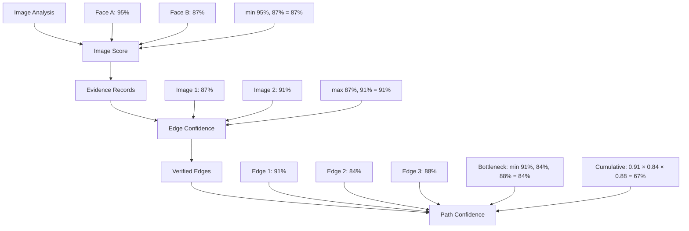

## Overview

Confidence scoring in Connected operates at three levels: **image score**, **edge confidence**, and **path confidence**. Each level builds on the previous one to provide a reliable measure of connection strength.

## Confidence Hierarchy



## Image Score

The image score measures the confidence that both people appear in a single image.

### Calculation

**Implementation:** `packages/core/src/confidence.ts:206-222`

```typescript
/**
 * Calculate per-image evidence score: min(confA, confB)
 */
export function calculateImageScore(
  celebrities: DetectedCelebrity[],
  personA: string,
  personB: string
): number | null {
  const celebA = findCelebrity(celebrities, personA);
  const celebB = findCelebrity(celebrities, personB);
  
  if (!celebA || !celebB) {
    return null;
  }
  
  // Image score is the MINIMUM of the two confidences
  // This represents the weakest link in the detection
  return Math.min(celebA.confidence, celebB.confidence);
}
```

<Note>
  **Why Minimum?** The image score uses the minimum confidence because a connection is only as strong as its weakest detection. If Person A is detected at 95% but Person B at only 70%, we're only 70% confident they're both in the image.
</Note>

### Example

```typescript
const celebrities = [
  { name: "Taylor Swift", confidence: 95.5 },
  { name: "Selena Gomez", confidence: 87.2 },
  { name: "Other Person", confidence: 92.1 },
];

const score = calculateImageScore(
  celebrities, 
  "Taylor Swift", 
  "Selena Gomez"
);
// Returns: 87.2 (the minimum of 95.5 and 87.2)
```

## Edge Confidence

Edge confidence represents the strength of the verified connection between two people based on all available evidence.

### Calculation

**Implementation:** `packages/core/src/confidence.ts:261-269`

```typescript
/**
 * Calculate edge confidence: max(imageScore) over all valid evidence images
 */
export function calculateEdgeConfidence(evidence: EvidenceRecord[]): number {
  if (evidence.length === 0) {
    return 0;
  }
  
  // Edge confidence is the MAXIMUM image score across all evidence
  // We take the best/strongest evidence for this connection
  return Math.max(...evidence.map((e) => e.imageScore));
}
```

<Tip>
  **Why Maximum?** Edge confidence uses the maximum score because we select the best evidence. If we have 5 photos with scores [82, 75, 91, 88, 79], the strongest evidence (91%) best represents the connection.
</Tip>

### Creating Verified Edges

**Implementation:** `packages/core/src/confidence.ts:271-298`

```typescript
export function createVerifiedEdge(
  personA: string,
  personB: string,
  evidence: EvidenceRecord[]
): VerifiedEdge | null {
  if (evidence.length === 0) {
    return null;
  }
  
  const edgeConfidence = calculateEdgeConfidence(evidence);
  
  // Find best evidence (highest imageScore)
  const bestEvidence = evidence.reduce((best, current) =>
    current.imageScore > best.imageScore ? current : best
  );
  
  return {
    from: personA,
    to: personB,
    edgeConfidence,
    evidence,           // All supporting evidence
    bestEvidence,       // Strongest single piece of evidence
  };
}
```

### Example

```typescript
const evidence: EvidenceRecord[] = [
  {
    from: "Taylor Swift",
    to: "Selena Gomez",
    imageUrl: "https://example.com/photo1.jpg",
    thumbnailUrl: "...",
    contextUrl: "...",
    title: "AMA Awards 2015",
    detectedCelebs: [
      { name: "Taylor Swift", confidence: 94.2 },
      { name: "Selena Gomez", confidence: 88.7 },
    ],
    imageScore: 88.7, // min(94.2, 88.7)
  },
  {
    from: "Taylor Swift",
    to: "Selena Gomez",
    imageUrl: "https://example.com/photo2.jpg",
    thumbnailUrl: "...",
    contextUrl: "...",
    title: "Met Gala 2016",
    detectedCelebs: [
      { name: "Taylor Swift", confidence: 96.1 },
      { name: "Selena Gomez", confidence: 92.4 },
    ],
    imageScore: 92.4, // min(96.1, 92.4)
  },
];

const edge = createVerifiedEdge("Taylor Swift", "Selena Gomez", evidence);
// edge.edgeConfidence = 92.4 (max of 88.7 and 92.4)
// edge.bestEvidence = second photo (highest score)
```

## Path Confidence

Path confidence measures the overall strength of a complete connection path.

### Two Metrics

Connected calculates two complementary confidence metrics for paths:

<CardGroup cols={2}>
  <Card title="Path Bottleneck" icon="link">
    The minimum edge confidence in the path - identifies the weakest link
  </Card>
  <Card title="Path Cumulative" icon="calculator">
    The product of all edge confidences - represents overall likelihood
  </Card>
</CardGroup>

### Calculation

**Implementation:** `packages/core/src/confidence.ts:300-323`

```typescript
export interface PathConfidence {
  pathBottleneck: number;     // min(edgeConfidence) - weakest link
  pathCumulative: number;     // product(edgeConfidence / 100) - overall probability
}

/**
 * Calculate path confidence metrics
 * - pathBottleneck: min(edgeConfidence) across all edges
 * - pathCumulative: product(edgeConfidence / 100) as decimal 0-1
 */
export function calculatePathConfidence(edges: VerifiedEdge[]): PathConfidence {
  if (edges.length === 0) {
    return { pathBottleneck: 0, pathCumulative: 0 };
  }
  
  const confidences = edges.map((e) => e.edgeConfidence);
  
  // Bottleneck: weakest link in the chain
  const pathBottleneck = Math.min(...confidences);
  
  // Cumulative: multiply probabilities (convert to 0-1 range)
  const pathCumulative = confidences.reduce(
    (product, conf) => product * (conf / 100),
    1
  );
  
  return {
    pathBottleneck,
    pathCumulative,
  };
}
```

### Example

```typescript
const edges: VerifiedEdge[] = [
  { 
    from: "Person A", 
    to: "Bridge 1", 
    edgeConfidence: 91.2,
    evidence: [...],
    bestEvidence: {...}
  },
  { 
    from: "Bridge 1", 
    to: "Bridge 2", 
    edgeConfidence: 84.5,
    evidence: [...],
    bestEvidence: {...}
  },
  { 
    from: "Bridge 2", 
    to: "Person B", 
    edgeConfidence: 88.7,
    evidence: [...],
    bestEvidence: {...}
  },
];

const pathConf = calculatePathConfidence(edges);

// pathBottleneck = 84.5 (the weakest edge)
// This tells us the connection is only as strong as its weakest link

// pathCumulative = 0.912 * 0.845 * 0.887 = 0.68
// This represents the compound probability across all edges
```

### Interpretation

<Tabs>
  <Tab title="Path Bottleneck">
    **Path Bottleneck** identifies the weakest connection in the chain.
    
    - **≥ 90%**: Excellent - all connections are very strong
    - **80-89%**: Good - solid connections throughout
    - **70-79%**: Fair - at least one weaker connection
    - **< 70%**: Weak - questionable connection in the path
    
    This metric is useful for identifying which edge needs better evidence.
  </Tab>
  
  <Tab title="Path Cumulative">
    **Path Cumulative** represents the compound probability.
    
    For a 3-hop path with edges at 91%, 85%, and 89%:
    ```
    0.91 × 0.85 × 0.89 = 0.68 (68%)
    ```
    
    This metric decreases with path length:
    - **1 hop**: cumulative ≈ bottleneck
    - **2 hops**: cumulative = conf1 × conf2
    - **3 hops**: cumulative = conf1 × conf2 × conf3
    
    Longer paths naturally have lower cumulative confidence even if all edges are strong.
  </Tab>
</Tabs>

## Validation Threshold

All confidence calculations respect a minimum threshold:

```typescript
const DEFAULT_CONFIG = {
  confidenceThreshold: 80, // Minimum confidence for valid evidence
};

export function isValidEvidence(
  celebrities: DetectedCelebrity[],
  personA: string,
  personB: string,
  confidenceThreshold: number = 80
): boolean {
  const celebA = findCelebrity(celebrities, personA);
  const celebB = findCelebrity(celebrities, personB);
  
  if (!celebA || !celebB) {
    return false;
  }
  
  return (
    celebA.confidence >= confidenceThreshold &&
    celebB.confidence >= confidenceThreshold
  );
}
```

<Warning>
  **Threshold Enforcement**: Only evidence where BOTH people are detected at ≥80% confidence is considered valid. This prevents false positives from uncertain detections.
</Warning>

## Visual Representation

### In the UI

Confidence scores are displayed throughout the Connected interface:

**Edge Tooltips:**
```typescript
<div className="text-xs text-zinc-500">
  {Math.round(edge.confidence)}% confidence
</div>
```

**Path Summary:**
```typescript
const confidence = calculatePathConfidence(edges);

<div>
  <p>Bottleneck: {Math.round(confidence.pathBottleneck)}%</p>
  <p>Cumulative: {Math.round(confidence.pathCumulative * 100)}%</p>
</div>
```

**Edge Thickness:**
```typescript
// Edges are rendered thicker based on confidence
const edgeSize = Math.max(1, edge.confidence / 25);

graph.addEdge(source, target, {
  size: edgeSize,
  color: `rgba(99, 102, 241, ${edge.confidence / 100})`,
});
```

## Best Practices

<CardGroup cols={2}>
  <Card title="Multiple Evidence" icon="images">
    Collect multiple evidence photos per edge to improve confidence through max selection.
  </Card>
  <Card title="Quality over Quantity" icon="medal">
    One high-confidence image (95%) is better than many low-confidence images (70%).
  </Card>
  <Card title="Threshold Consistency" icon="equals">
    Use the same 80% threshold across all verification layers for consistency.
  </Card>
  <Card title="Path Length Awareness" icon="route">
    Understand that cumulative confidence naturally decreases with path length.
  </Card>
</CardGroup>

## Mathematical Properties

### Image Score
- **Range**: 0-100%
- **Formula**: `min(confidenceA, confidenceB)`
- **Property**: Symmetric - order doesn't matter

### Edge Confidence
- **Range**: 0-100%
- **Formula**: `max(imageScore₁, imageScore₂, ..., imageScoreₙ)`
- **Property**: Monotonically increasing with more evidence

### Path Bottleneck
- **Range**: 0-100%
- **Formula**: `min(edgeConf₁, edgeConf₂, ..., edgeConfₙ)`
- **Property**: Upper-bounded by weakest edge

### Path Cumulative
- **Range**: 0-1 (0-100% when displayed)
- **Formula**: `∏(edgeConfᵢ / 100)`
- **Property**: Decreases exponentially with path length

## Related Features

- [Evidence Verification](/features/evidence-verification) - How confidence is measured
- [Investigation Pipeline](/features/investigation-pipeline) - How confidence affects path selection
- [Graph Visualization](/features/graph-visualization) - How confidence is rendered visually
