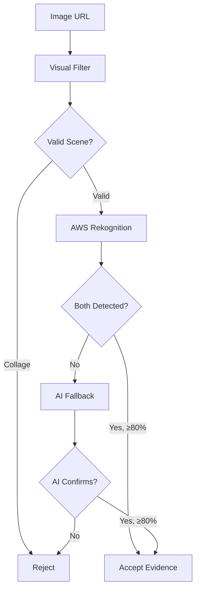

## Overview

Every edge in the social graph requires photographic evidence showing both people together in the same scene. Connected uses a **dual-layer verification strategy** that combines AWS Rekognition's celebrity recognition with AI vision analysis for comprehensive coverage.

## Verification Pipeline



## Layer 1: Visual Filtering

Before any face detection, images are validated to ensure they show a real scene rather than a composite.

### Visual Co-Presence Check

**Implementation:** `apps/worker/src/tools/verify.ts`

```typescript
interface VisualFilterResult {
  isValidScene: boolean;
  reason: string;
}

export const verifyVisualCopresence = (env: Env) => async ({
  imageUrl,
}: {
  imageUrl: string;
}): Promise<VisualFilterResult> => {
  const client = new OpenRouterClient({
    apiKey: env.OPENROUTER_API_KEY,
    model: "google/gemini-2.0-flash-001",
  });
  
  const result = await client.analyzeImageForCopresence(imageUrl);
  
  return {
    isValidScene: result.isValidScene,
    reason: result.reason,
  };
};
```

**Rejection Criteria:**

<CardGroup cols={2}>
  <Card title="Photo Collages" icon="images">
    Multiple separate photos combined into one image
  </Card>
  <Card title="Side-by-Side Comparisons" icon="arrow-right-arrow-left">
    Split-screen layouts showing people separately
  </Card>
  <Card title="Composite Images" icon="layer-group">
    Digitally manipulated images merging multiple sources
  </Card>
  <Card title="Magazine Layouts" icon="newspaper">
    Editorial designs with multiple separate photos
  </Card>
</CardGroup>

<Note>
  **Why This Matters**: Photo collages often appear in Google Image search results when querying two names together, but they don't prove the people were actually together. Visual filtering eliminates these false positives.
</Note>

### Example Validation

```typescript
// Valid scene - both people in same photo
const visual = await verifyCopresence({ 
  imageUrl: "https://example.com/event-photo.jpg" 
});
// { isValidScene: true, reason: "Single continuous scene" }

// Invalid scene - collage detected
const visual = await verifyCopresence({ 
  imageUrl: "https://example.com/side-by-side.jpg" 
});
// { isValidScene: false, reason: "Multiple separate photos in grid layout" }
```

## Layer 2: Celebrity Recognition

### AWS Rekognition

The primary verification layer uses Amazon Rekognition's Celebrity Recognition API.

**Implementation:** `apps/worker/src/tools/detect-celebrities.ts`

```typescript
import { RekognitionClient, RecognizeCelebritiesCommand } from "@aws-sdk/client-rekognition";

export const detectCelebritiesInImage = (env: Env) => async ({
  imageUrl,
}: {
  imageUrl: string;
}): Promise<{
  celebrities: Array<{
    name: string;
    confidence: number;
    urls?: string[];
  }>;
}> => {
  const rekognition = new RekognitionClient({
    region: env.AWS_REGION,
    credentials: {
      accessKeyId: env.AWS_ACCESS_KEY_ID,
      secretAccessKey: env.AWS_SECRET_ACCESS_KEY,
    },
  });
  
  // Fetch image bytes
  const imageResponse = await fetch(imageUrl);
  const imageBytes = new Uint8Array(await imageResponse.arrayBuffer());
  
  // Detect celebrities
  const command = new RecognizeCelebritiesCommand({
    Image: { Bytes: imageBytes },
  });
  
  const response = await rekognition.send(command);
  
  return {
    celebrities: response.CelebrityFaces?.map((face) => ({
      name: face.Name || "Unknown",
      confidence: face.MatchConfidence || 0,
      urls: face.Urls,
    })) || [],
  };
};
```

**Confidence Threshold:**

```typescript
const DEFAULT_CONFIG = {
  confidenceThreshold: 80, // Minimum confidence percentage
};

function isValidEvidence(
  celebrities: DetectedCelebrity[],
  personA: string,
  personB: string,
  confidenceThreshold: number = 80
): boolean {
  const celebA = findCelebrity(celebrities, personA);
  const celebB = findCelebrity(celebrities, personB);
  
  if (!celebA || !celebB) return false;
  
  return (
    celebA.confidence >= confidenceThreshold &&
    celebB.confidence >= confidenceThreshold
  );
}
```

<Tip>
  **Why 80%?** This threshold balances precision and recall. Lower values produce false positives (incorrect matches), while higher values miss valid connections. 80% confidence provides reliable celebrity recognition based on testing.
</Tip>

### Name Matching

The system uses flexible name matching to handle variations:

**Implementation:** `packages/core/src/confidence.ts:24-164`

```typescript
export function namesMatch(name1: string, name2: string): boolean {
  const n1 = normalizeName(name1);
  const n2 = normalizeName(name2);
  
  // 1. Exact match (after normalization)
  if (n1 === n2) return true;
  
  // 2. Known celebrity aliases (e.g., "Kanye West" vs "Ye")
  if (areAliases(name1, name2)) return true;
  
  // 3. Reversed name order (e.g., "Obama Barack" vs "Barack Obama")
  const parts1 = n1.split(" ");
  const parts2 = n2.split(" ");
  if (parts1.length === 2 && parts2.length === 2) {
    if (parts1[0] === parts2[1] && parts1[1] === parts2[0]) return true;
  }
  
  // 4. Word containment (e.g., "Trump" matches "Donald Trump")
  const [shorter, longer] = n1.length < n2.length ? [n1, n2] : [n2, n1];
  if (wordsContainedIn(shorter, longer)) return true;
  
  // 5. Surname + first name match (handles middle names)
  const surname1 = extractSurname(name1);
  const surname2 = extractSurname(name2);
  const firstName1 = extractFirstName(name1);
  const firstName2 = extractFirstName(name2);
  if (surname1 === surname2 && firstName1 === firstName2) return true;
  
  return false;
}
```

**Celebrity Aliases:**

```typescript
const CELEBRITY_ALIASES: Record<string, string[]> = {
  "kanye west": ["ye", "kanye"],
  "sean combs": ["p. diddy", "puff daddy", "diddy"],
  "dwayne johnson": ["the rock"],
  "stefani germanotta": ["lady gaga"],
  // ... more aliases
};
```

## Layer 3: AI Fallback

When Rekognition doesn't recognize someone, the system falls back to AI vision analysis.

**Implementation:** `apps/worker/src/tools/verify-celebrities.ts`

```typescript
export const verifyCelebritiesWithAI = (env: Env) => async ({
  imageUrl,
  personA,
  personB,
}: {
  imageUrl: string;
  personA: string;
  personB: string;
}): Promise<{
  personAFound: boolean;
  personAConfidence: number;
  personBFound: boolean;
  personBConfidence: number;
  togetherInScene: boolean;
  overallConfidence: number;
  notes: string;
}> => {
  const client = new OpenRouterClient({
    apiKey: env.OPENROUTER_API_KEY,
    model: "google/gemini-2.0-flash-001",
  });
  
  return await client.verifyCelebritiesInImage(imageUrl, personA, personB);
};
```

**Usage in Pipeline:**

```typescript
// Try Rekognition first
const analysis = await detectCelebrities({ imageUrl: img.imageUrl });

if (isValidEvidence(analysis.celebrities, personA, personB, confidenceThreshold)) {
  // Rekognition succeeded
  evidence.push(createEvidenceRecord(img, analysis, personA, personB));
} else {
  // Fallback to AI verification
  try {
    const aiVerification = await verifyCelebritiesAI({ 
      imageUrl: img.imageUrl, 
      personA, 
      personB 
    });
    
    if (aiVerification.togetherInScene && 
        aiVerification.overallConfidence >= confidenceThreshold) {
      // AI verification succeeded
      const aiRecord: EvidenceRecord = {
        from: personA,
        to: personB,
        imageUrl: img.imageUrl,
        thumbnailUrl: img.thumbnailUrl,
        contextUrl: img.contextUrl,
        title: img.title,
        detectedCelebs: [
          { name: personA, confidence: aiVerification.personAConfidence },
          { name: personB, confidence: aiVerification.personBConfidence },
        ],
        imageScore: aiVerification.overallConfidence,
      };
      evidence.push(aiRecord);
    }
  } catch (aiError) {
    // AI verification failed - no evidence for this image
  }
}
```

<Warning>
  **Fallback Strategy**: AI verification is only used when Rekognition fails to detect one or both people. This ensures we get the accuracy of Rekognition when possible, while still being able to verify connections for people not in Rekognition's celebrity database.
</Warning>

## Evidence Records

### Data Structure

```typescript
interface EvidenceRecord {
  from: string;
  to: string;
  imageUrl: string;           // Full-resolution image
  thumbnailUrl: string;       // Low-res preview
  contextUrl: string;         // Original web page
  title: string;              // Image title/caption
  detectedCelebs: Array<{     // Detected faces
    name: string;
    confidence: number;
  }>;
  imageScore: number;         // Overall confidence for this image
}
```

### Creating Evidence

```typescript
export function createEvidenceRecord(
  searchResult: ImageSearchResult,
  analysis: ImageAnalysisResult,
  personA: string,
  personB: string
): EvidenceRecord | null {
  const imageScore = calculateImageScore(analysis.celebrities, personA, personB);
  if (imageScore === null) return null;
  
  const celebA = findCelebrity(analysis.celebrities, personA);
  const celebB = findCelebrity(analysis.celebrities, personB);
  if (!celebA || !celebB) return null;
  
  return {
    from: personA,
    to: personB,
    imageUrl: searchResult.imageUrl,
    thumbnailUrl: searchResult.thumbnailUrl,
    contextUrl: searchResult.contextUrl,
    title: searchResult.title,
    detectedCelebs: [
      { name: celebA.name, confidence: celebA.confidence },
      { name: celebB.name, confidence: celebB.confidence },
    ],
    imageScore,
  };
}
```

## Verification Queries

Multiple query variations are tried to find evidence:

```typescript
export function verificationQueries(person1: string, person2: string): string[] {
  return [
    `${person1} ${person2}`,
    `${person2} ${person1}`, // Try reversed order
  ];
}

export function bridgeQueries(bridge: string, target: string): string[] {
  return [
    `${bridge} ${target}`,
    `${target} ${bridge}`,
  ];
}
```

## Best Practices

<CardGroup cols={2}>
  <Card title="Early Exit" icon="bolt">
    Stop processing as soon as valid evidence is found for an image to save API calls.
  </Card>
  <Card title="Error Handling" icon="shield-check">
    Gracefully handle API failures and continue with next image.
  </Card>
  <Card title="Budget Awareness" icon="wallet">
    Track API calls and respect budget limits during verification.
  </Card>
  <Card title="Confidence Thresholds" icon="gauge">
    Use consistent 80% threshold across both verification layers.
  </Card>
</CardGroup>

## Related Features

- [Confidence Scoring](/features/confidence-scoring) - How evidence quality affects path confidence
- [Investigation Pipeline](/features/investigation-pipeline) - How verification fits into the overall workflow
- [Real-Time Streaming](/features/real-time-streaming) - How verification results are streamed to the UI
