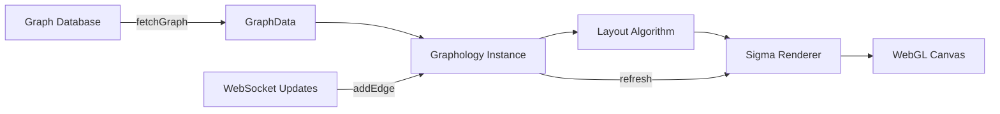

## Overview

Connected uses [Sigma.js](https://www.sigmajs.org/) and [Graphology](https://graphology.github.io/) to render an interactive force-directed graph visualization of discovered connections. The graph updates in real-time as new edges are verified during investigations.

## Architecture

<CardGroup cols={2}>
  <Card title="Rendering Engine" icon="chart-network">
    **Sigma.js** - WebGL-accelerated graph renderer with smooth animations and touch support
  </Card>
  <Card title="Graph Data Structure" icon="project-diagram">
    **Graphology** - Efficient in-memory graph with layout algorithms
  </Card>
  <Card title="Layout Algorithm" icon="arrows-split-up-and-left">
    **ForceAtlas2** - Physics-based layout that groups connected nodes
  </Card>
  <Card title="Real-Time Updates" icon="bolt">
    **WebSocket** via Durable Objects for instant graph updates
  </Card>
</CardGroup>

## Core Components

### 1. Social Graph (Full-Featured)

**Location:** `apps/web/src/components/social-graph.tsx`

The main graph component with search, filtering, and evidence viewing capabilities.

```typescript
import { SocialGraph } from "@/components/social-graph";

<SocialGraph 
  className="h-full"
  autoRefresh={false}
  autoRefreshInterval={3000}
  onStatsChange={(stats) => {
    console.log(`${stats.nodes} people, ${stats.edges} connections`);
  }}
/>
```

**Features:**

- **Search**: Type-ahead search to find and focus on specific people
- **Node Focus**: Click a person to see only their direct connections
- **Evidence Preview**: Click edges to view supporting photo evidence
- **Live Updates**: Real-time edge additions via WebSocket
- **Graph Controls**: Zoom, pan, reset view

### 2. Live Graph (Investigation Viewer)

**Location:** `apps/web/src/components/live-graph.tsx`

A lightweight graph specifically for investigation tracking with highlighting.

```typescript
import { LiveGraph } from "@/components/live-graph";

const highlightedNodes = new Set(["Person A", "Bridge Person", "Person B"]);
const highlightedEdges = new Set(["Person A_Bridge Person", "Bridge Person_Person B"]);

<LiveGraph 
  compact={true}
  highlightedNodeIds={highlightedNodes}
  highlightedEdgeKeys={highlightedEdges}
/>
```

**Features:**

- **Path Highlighting**: Emphasizes current investigation path
- **Pulse Animations**: New nodes and edges pulse when added
- **Compact Mode**: Smaller controls and text for embedded use
- **Imperative API**: Programmatic control via ref

## Visualization Pipeline



## Graph Initialization

### 1. Fetch Graph Data

```typescript
// apps/web/src/lib/api-client.ts
export async function fetchGraph(): Promise<{
  nodes: Array<{ id: string; name: string; thumbnailUrl: string | null }>;
  edges: Array<{
    id: string;
    source: string;
    target: string;
    confidence: number;
    evidenceUrl: string | null;
    thumbnailUrl: string | null;
    contextUrl: string | null;
  }>;
}> {
  const res = await fetch("/api/graph");
  return res.json();
}
```

### 2. Build Graphology Instance

```typescript
import Graph from "graphology";
import { circular } from "graphology-layout";
import forceAtlas2 from "graphology-layout-forceatlas2";

const graph = new Graph();

// Add nodes with visual attributes
data.nodes.forEach((node, index) => {
  graph.addNode(node.id, {
    label: node.name,
    size: 15,
    color: getNodeColor(index),
    x: Math.random() * 100,
    y: Math.random() * 100,
    thumbnailUrl: node.thumbnailUrl,
  });
});

// Add edges with confidence-based thickness
data.edges.forEach((edge) => {
  if (graph.hasNode(edge.source) && graph.hasNode(edge.target)) {
    const edgeSize = Math.max(1, edge.confidence / 25);
    graph.addEdge(edge.source, edge.target, {
      size: edgeSize,
      color: `rgba(99, 102, 241, ${edge.confidence / 100})`,
      confidence: edge.confidence,
      thumbnailUrl: edge.thumbnailUrl,
      contextUrl: edge.contextUrl,
    });
  }
});
```

### 3. Apply Layout

```typescript
// Start with circular layout for initial positioning
circular.assign(graph);

// Apply force-directed layout for natural clustering
if (graph.order > 1) {
  const settings = forceAtlas2.inferSettings(graph);
  forceAtlas2.assign(graph, {
    settings: { ...settings, gravity: 1 },
    iterations: 100
  });
}
```

<Tip>
  **Layout Strategy**: Circular layout provides symmetric initial positioning, then ForceAtlas2 organizes nodes based on connections, creating natural clusters of related people.
</Tip>

### 4. Render with Sigma

```typescript
const sigma = new Sigma(graph, containerRef.current, {
  renderLabels: true,
  labelSize: 14,
  labelWeight: "bold",
  labelColor: { color: "#18181b" },
  defaultEdgeType: "line",
  enableEdgeEvents: true,
  pickingDistance: 15, // Larger hit area for touch devices
});
```

## Interactive Features

### Node Hover Effects

```typescript
sigma.on("enterNode", ({ node }) => {
  hoveredNodeRef.current = node;
  hoveredNeighborsRef.current = new Set(graph.neighbors(node));
  sigma.refresh();
});

// Node reducer - dims unconnected nodes when hovering
nodeReducer: (node, data) => {
  const res = { ...data };
  const hovered = hoveredNodeRef.current;
  
  if (hovered) {
    if (node === hovered) {
      // Hovered node - enlarge and highlight
      res.size = data.size * 1.3;
      res.zIndex = 10;
    } else if (hoveredNeighborsRef.current.has(node)) {
      // Connected neighbor - keep visible
      res.zIndex = 5;
    } else {
      // Not connected - dim
      res.color = data.color + "40"; // 25% opacity
      res.zIndex = 0;
    }
  }
  
  return res;
}
```

### Edge Click for Evidence

```typescript
sigma.on("clickEdge", ({ edge }) => {
  const attrs = graph.getEdgeAttributes(edge);
  const source = graph.source(edge);
  const target = graph.target(edge);
  
  // Open evidence modal
  setPreviewModal({
    open: true,
    imageUrl: attrs.evidenceUrl || attrs.thumbnailUrl,
    sourceUrl: attrs.contextUrl,
    title: `${source} ↔ ${target}`,
  });
});
```

### Node Search and Focus

```typescript
const focusNode = (nodeId: string) => {
  // Filter to only show the focused node and its neighbors
  const connectedNodeIds = new Set([nodeId]);
  
  data.edges.forEach((edge) => {
    if (edge.source === nodeId) connectedNodeIds.add(edge.target);
    if (edge.target === nodeId) connectedNodeIds.add(edge.source);
  });
  
  const filteredNodes = data.nodes.filter((n) => connectedNodeIds.has(n.id));
  const filteredEdges = data.edges.filter(
    (e) => connectedNodeIds.has(e.source) && connectedNodeIds.has(e.target)
  );
  
  renderGraph({ nodes: filteredNodes, edges: filteredEdges }, nodeId);
};
```

## Real-Time Updates

### WebSocket Subscription

```typescript
import { useGraphSubscription } from "@/hooks/use-graph-subscription";

const handleEdgeUpdate = useCallback((edge: GraphEdgeUpdate) => {
  const graph = graphRef.current;
  const sigma = sigmaRef.current;
  if (!graph || !sigma) return;
  
  // Add nodes if they don't exist
  if (!graph.hasNode(edge.source)) {
    graph.addNode(edge.source, {
      label: edge.source,
      size: 15,
      color: getNodeColor(edge.source),
      x: Math.random() * 100,
      y: Math.random() * 100,
    });
  }
  
  // Add edge if it doesn't exist
  if (!graph.hasEdge(edge.source, edge.target)) {
    const edgeSize = Math.max(1, edge.confidence / 25);
    graph.addEdge(edge.source, edge.target, {
      size: edgeSize,
      color: `rgba(99, 102, 241, ${edge.confidence / 100})`,
      confidence: edge.confidence,
      thumbnailUrl: edge.thumbnailUrl,
      contextUrl: edge.contextUrl,
    });
    
    // Trigger pulse animation
    pulseNodes(graph, sigma, [edge.source, edge.target]);
    
    sigma.refresh();
  }
}, []);

const { isConnected } = useGraphSubscription({
  onEdgeUpdate: handleEdgeUpdate,
  enabled: true,
});
```

### Pulse Animation

```typescript
function pulseNodes(
  graph: Graph,
  sigma: Sigma,
  nodeIds: string[],
  baseSize: number = 15
): void {
  const startTime = performance.now();
  const duration = 400;
  
  function animate(currentTime: number) {
    const elapsed = currentTime - startTime;
    const progress = Math.min(elapsed / duration, 1);
    
    // Smooth pulse: grows then shrinks back
    const scale = 1 + 0.3 * Math.sin(progress * Math.PI);
    
    nodeIds.forEach((nodeId) => {
      if (graph.hasNode(nodeId)) {
        graph.setNodeAttribute(nodeId, "size", baseSize * scale);
      }
    });
    
    if (progress < 1) {
      requestAnimationFrame(animate);
    } else {
      // Reset to base size
      nodeIds.forEach((nodeId) => {
        if (graph.hasNode(nodeId)) {
          graph.setNodeAttribute(nodeId, "size", baseSize);
        }
      });
    }
    
    sigma.refresh();
  }
  
  requestAnimationFrame(animate);
}
```

## Performance Optimizations

<CardGroup cols={2}>
  <Card title="WebGL Rendering" icon="bolt">
    Sigma uses WebGL for hardware-accelerated rendering, handling thousands of nodes smoothly.
  </Card>
  <Card title="Debounced Refresh" icon="clock">
    Graph refreshes are debounced to prevent flickering during rapid updates.
  </Card>
  <Card title="Layout Caching" icon="database">
    Node positions are preserved during updates to prevent layout jumps.
  </Card>
  <Card title="Event Batching" icon="layer-group">
    Multiple WebSocket events are batched into single render cycles.
  </Card>
</CardGroup>

### Debounced Refresh

```typescript
function createDebouncedRefresh(delay = 50) {
  let timeoutId: NodeJS.Timeout | null = null;
  return (sigma: Sigma | null) => {
    if (!sigma) return;
    if (timeoutId) clearTimeout(timeoutId);
    timeoutId = setTimeout(() => {
      sigma.refresh();
    }, delay);
  };
}

const debouncedRefresh = createDebouncedRefresh(30);
```

## Mobile Optimization

```typescript
// Larger edge thickness for easier touch
const isMobileDevice = typeof window !== 'undefined' && 
  window.matchMedia('(pointer: coarse)').matches;

const baseEdgeSize = isMobileDevice ? 3 : 1.5;
const edgeSize = Math.max(baseEdgeSize, edge.confidence / (isMobileDevice ? 20 : 30));

// Larger picking distance for touch
const sigma = new Sigma(graph, container, {
  pickingDistance: 15, // Larger hit area
  // ...
});
```

## Color Palette

```typescript
const NODE_COLORS = [
  "#6366f1", // indigo
  "#8b5cf6", // violet  
  "#0ea5e9", // sky blue
  "#10b981", // emerald
];

function getNodeColor(index: number): string {
  return NODE_COLORS[index % NODE_COLORS.length];
}
```

## Related Features

- [Real-Time Streaming](/features/real-time-streaming) - WebSocket architecture for live updates
- [Investigation Pipeline](/features/investigation-pipeline) - How connections are discovered
- [Evidence Verification](/features/evidence-verification) - Image validation before adding to graph
