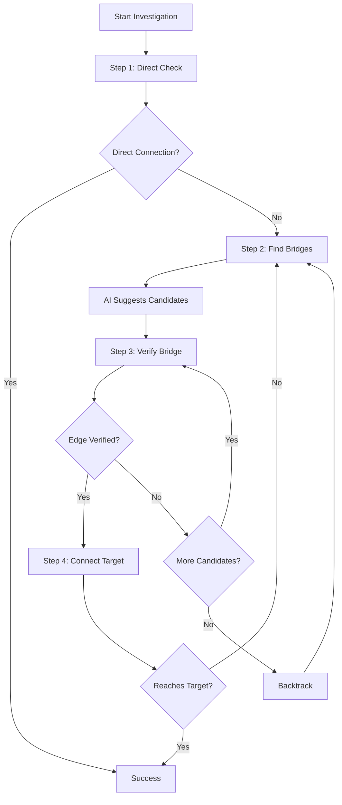

## Overview

Connected uses a sophisticated multi-step investigation pipeline to discover visual connections between two people. The pipeline combines AI planning, image search, facial recognition, and graph traversal to build verified relationship paths.

## Pipeline Architecture

The investigation follows a depth-first search (DFS) strategy with intelligent backtracking:



## Investigation Steps

### Step 1: Direct Connection Check

The pipeline first attempts to find a direct connection between the two people.

<Steps>
  <Step title="Query Generation">
    Generates search query: `"Person A Person B"`
  </Step>
  <Step title="Image Search">
    Searches for images using Google Custom Search API
  </Step>
  <Step title="Visual Filtering">
    Uses AI vision to filter out collages and composite images
  </Step>
  <Step title="Face Detection">
    Analyzes images with AWS Rekognition Celebrity Recognition
  </Step>
  <Step title="Evidence Validation">
    Validates both people are detected with ≥80% confidence
  </Step>
</Steps>

**Implementation:** `apps/worker/src/workflows/investigation.ts:320-508`

```typescript
const directEdge = await step.do("direct-attempt", async () => {
  const query = directQuery(personA, personB);
  const searchRes = await searchImages({ query });
  const images = searchRes.results.slice(0, DEFAULT_CONFIG.imagesPerQuery);
  
  for (const img of images) {
    // Visual check (LLM call)
    const visual = await verifyCopresence({ imageUrl: img.imageUrl });
    if (!visual.isValidScene) continue;
    
    // Detect celebrities with Rekognition
    const analysis = await detectCelebrities({ imageUrl: img.imageUrl });
    
    if (isValidEvidence(analysis.celebrities, personA, personB, confidenceThreshold)) {
      const record = createEvidenceRecord(img, analysis, personA, personB);
      if (record) {
        evidence.push(record);
        break; // Early exit - evidence found!
      }
    }
  }
  
  if (evidence.length > 0) {
    return createVerifiedEdge(personA, personB, evidence);
  }
  return null;
});
```

### Step 2: Finding Bridge Candidates

When no direct connection exists, the system discovers intermediate people ("bridges").

<CardGroup cols={2}>
  <Card title="AI Suggestions" icon="sparkles">
    Uses LLM world knowledge to suggest relevant intermediaries based on shared industries, events, or social circles.
  </Card>
  <Card title="Image Discovery" icon="image">
    Searches for images of the frontier person at events, premieres, and public appearances to find co-appearing celebrities.
  </Card>
</CardGroup>

**Discovery Queries:**

```typescript
// packages/core/src/query-templates.ts
export function discoveryQueries(person: string): string[] {
  return [
    `${person} premiere`,
    `${person} event`,
    `${person} red carpet`,
    `${person} gala`,
    `${person} awards`,
  ];
}
```

**AI Bridge Suggestions:**

```typescript
// Uses OpenRouter with Gemini Flash for fast, knowledgeable suggestions
const suggestedBridges = await planner.suggestBridgeCandidates(personA, personB);
// Returns: [{ name: string, reasoning: string, confidence: number }, ...]
```

### Step 3: Verify Bridge Connection

For each candidate bridge, the system attempts to verify the connection.

```typescript
// Verification uses multiple query variations
const queries = verificationQueries(currentFrontier, candidateName);
// ["Person A Person B", "Person B Person A"]

for (const query of queries) {
  const searchRes = await searchImages({ query });
  
  for (const img of searchRes.results) {
    // 1. Visual filtering (AI)
    const visual = await verifyCopresence({ imageUrl: img.imageUrl });
    if (!visual.isValidScene) continue;
    
    // 2. Celebrity detection (Rekognition)
    const analysis = await detectCelebrities({ imageUrl: img.imageUrl });
    
    // 3. Fallback to AI verification if Rekognition fails
    if (!isValidEvidence(analysis.celebrities, person1, person2)) {
      const aiVerification = await verifyCelebritiesAI({ 
        imageUrl: img.imageUrl, 
        personA: person1, 
        personB: person2 
      });
      
      if (aiVerification.togetherInScene && 
          aiVerification.overallConfidence >= confidenceThreshold) {
        // Use AI verification result
        evidence.push(createAIEvidenceRecord(...));
        break;
      }
    }
  }
}
```

<Note>
  **Dual Verification Strategy**: The system first uses AWS Rekognition for reliable celebrity detection, then falls back to AI vision (Gemini Flash) when Rekognition doesn't recognize someone. This provides both accuracy and coverage.
</Note>

### Step 4: Connect to Target

Once a bridge is verified, the system immediately attempts to connect that bridge to the target person.

```typescript
const bridgeEdge = await step.do(`bridge-${candidateName}`, async () => {
  const queries = bridgeQueries(candidateName, personB);
  // Same verification process as Step 3
  return await verifyEdge(candidateName, personB, queries);
});

if (bridgeEdge) {
  // Success! Found complete path
  state.verifiedEdges.push(bridgeEdge);
  state.path.push(personB);
  return finalizeSuccess(state);
}
```

## Depth-First Search Strategy

<Tip>
  Connected uses **DFS with backtracking** to explore connection paths efficiently. This allows the system to:
  - Try the most promising candidates first
  - Backtrack when a path doesn't lead to the target
  - Explore alternative paths without re-verifying edges
  - Find solutions quickly while staying within budget limits
</Tip>

### DFS Stack Frame

```typescript
interface DFSStackFrame {
  frontier: string;              // Current person being expanded
  candidates: string[];          // All available candidates at this level
  candidateIndex: number;        // Which candidate we chose
  edge: VerifiedEdge | null;     // The verified edge to this candidate
}

const dfsStack: DFSStackFrame[] = [];
const globalTriedCandidates = new Set<string>();
```

### Backtracking Logic

```typescript
const backtrack = async (): Promise<boolean> => {
  if (dfsStack.length === 0) return false;
  
  const poppedFrame = dfsStack.pop()!;
  
  // Restore state
  state.path.pop();
  state.verifiedEdges.pop();
  state.hopDepth = dfsStack.length;
  
  // Check for more candidates at the popped level
  const remainingCandidates = poppedFrame.candidates
    .slice(poppedFrame.candidateIndex + 1)
    .filter(name => !globalTriedCandidates.has(name.toLowerCase()));
  
  if (remainingCandidates.length > 0) {
    // Continue trying candidates at this level
    return true;
  }
  
  // No more candidates, continue backtracking
  return await backtrack();
};
```

## Budget Management

Investigations operate within strict resource budgets:

```typescript
interface InvestigationBudgets {
  maxSteps: 15;              // Maximum exploration steps (candidates tried)
  stepsUsed: number;
  maxSubrequests: 900;       // API calls (search, Rekognition, AI)
  subrequestsUsed: number;
}

const DEFAULT_BUDGETS = {
  maxSteps: 15,
  maxSubrequests: 900,
};
```

**Budget Tracking:**

```typescript
// Every external API call increments the budget
trackSubrequest(); // Google Image Search
trackSubrequest(); // LLM verifyCopresence
trackSubrequest(); // AWS Rekognition
trackSubrequest(); // LLM AI verification (fallback)

// Step budget increments when trying a new candidate
incrementStep();
```

<Warning>
  **Budget Exhaustion**: When budgets are exhausted, the investigation stops and returns the best path found so far, or reports no path if none was discovered.
</Warning>

## Configuration

The investigation pipeline is controlled by these configuration parameters:

```typescript
// packages/core/src/index.ts
export const DEFAULT_CONFIG = {
  hopLimit: 6,                  // Maximum degrees of separation
  confidenceThreshold: 80,      // Minimum confidence for face detection
  imagesPerQuery: 5,            // Images to analyze per search query
};
```

## State Management

```typescript
interface InvestigationState {
  personA: string;
  personB: string;
  frontier: string;                    // Current person being expanded
  hopDepth: number;                    // Current depth in DFS
  path: string[];                      // Current path being explored
  verifiedEdges: VerifiedEdge[];       // Verified connections
  failedCandidates: string[];          // Candidates that failed verification
  budgets: InvestigationBudgets;
  status: "running" | "success" | "no_path" | "error";
}
```

## Best Practices

<CardGroup cols={2}>
  <Card title="Early Exit" icon="bolt">
    The pipeline exits as soon as evidence is found for an edge, avoiding unnecessary API calls.
  </Card>
  <Card title="Parallel Verification" icon="arrows-split-up-and-left">
    Multiple verification strategies (Rekognition + AI) run in sequence with fallback logic.
  </Card>
  <Card title="Smart Caching" icon="database">
    Verified edges are persisted to the graph database for future investigations.
  </Card>
  <Card title="Progress Streaming" icon="rss">
    Real-time events are streamed via WebSocket for live UI updates.
  </Card>
</CardGroup>

## Related Features

- [Evidence Verification](/features/evidence-verification) - How images are validated
- [Confidence Scoring](/features/confidence-scoring) - How edge and path confidence is calculated
- [Real-Time Streaming](/features/real-time-streaming) - WebSocket event architecture
