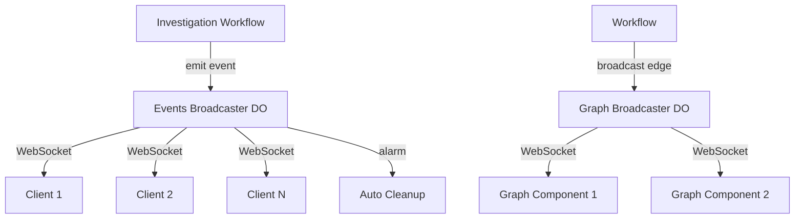

## Overview

Connected uses **Cloudflare Durable Objects** with hibernatable WebSockets to stream investigation progress and graph updates in real-time. This architecture provides instant feedback during long-running investigations while minimizing infrastructure costs.

## Architecture



<CardGroup cols={2}>
  <Card title="Investigation Events" icon="rss">
    Per-investigation event streams using `InvestigationEventsBroadcaster` Durable Object
  </Card>
  <Card title="Graph Updates" icon="chart-network">
    Global graph updates using singleton `GraphBroadcaster` Durable Object
  </Card>
  <Card title="Hibernation" icon="moon">
    DOs can sleep while WebSockets stay connected, reducing costs
  </Card>
  <Card title="Auto Cleanup" icon="trash">
    Expired investigation data is automatically cleaned up via alarms
  </Card>
</CardGroup>

## Investigation Event Streaming

### Broadcaster Implementation

**Location:** `apps/worker/src/durable-objects/investigation-events-broadcaster.ts`

```typescript
export class InvestigationEventsBroadcaster extends DurableObject {
  private eventIndex: number = 0;
  private isComplete: boolean = false;
  
  constructor(ctx: DurableObjectState, env: unknown) {
    super(ctx, env);
    // Restore state after hibernation
    this.ctx.blockConcurrencyWhile(async () => {
      const stored = await this.ctx.storage.get<number>("eventIndex");
      this.eventIndex = stored ?? 0;
      const complete = await this.ctx.storage.get<boolean>("isComplete");
      this.isComplete = complete ?? false;
    });
  }
  
  async fetch(request: Request): Promise<Response> {
    const url = new URL(request.url);
    
    // WebSocket upgrade for client connections
    if (request.headers.get("Upgrade") === "websocket") {
      return this.handleWebSocketUpgrade(request);
    }
    
    // POST /emit - Workflow emits events here
    if (url.pathname === "/emit" && request.method === "POST") {
      return this.handleEmit(request);
    }
    
    return new Response("Not Found", { status: 404 });
  }
}
```

### Event Emission from Workflow

**Location:** `apps/worker/src/workflows/investigation.ts:55-159`

```typescript
function createEventEmitter(env: Env, runId: string) {
  let eventIndex = 0;
  
  const emitRaw = async (
    type: InvestigationEventType,
    message: string,
    data?: InvestigationEvent["data"]
  ): Promise<void> => {
    const eventId = `${runId}:${String(eventIndex).padStart(6, "0")}`;
    
    const event: InvestigationEvent = {
      type,
      runId,
      timestamp: new Date().toISOString(),
      message,
      data: { ...data, eventId },
    };
    
    // Emit to Durable Object for real-time WebSocket streaming
    try {
      const doId = env.INVESTIGATION_EVENTS_BROADCASTER.idFromName(runId);
      const stub = env.INVESTIGATION_EVENTS_BROADCASTER.get(doId);
      await stub.fetch(new Request("https://internal/emit", {
        method: "POST",
        headers: { "Content-Type": "application/json" },
        body: JSON.stringify(event),
      }));
    } catch (error) {
      console.error("DO broadcast failed:", error);
    }
    
    eventIndex++;
  };
  
  return {
    emit: emitRaw,
    startStep: async (stepId: InvestigationStepId, title: string) => {
      await emitRaw("step_start", title, { stepId, stepStatus: "running" });
    },
    updateStep: async (message: string) => {
      await emitRaw("step_update", message);
    },
    completeStep: async (stepId: InvestigationStepId, success: boolean, message: string) => {
      await emitRaw("step_complete", message, {
        stepId,
        stepStatus: success ? "done" : "failed",
      });
    },
  };
}
```

### Event Buffering and Replay

Events are stored in Durable Object storage for late-joining clients:

```typescript
private async handleEmit(request: Request): Promise<Response> {
  const event = await request.json() as InvestigationEvent;
  
  // Store event with sequential index
  const index = this.eventIndex++;
  await this.ctx.storage.put(`event:${index}`, { event, index });
  await this.ctx.storage.put("eventIndex", this.eventIndex);
  
  // Check for completion
  if (event.type === "final" || event.type === "no_path" || event.type === "error") {
    this.isComplete = true;
    await this.ctx.storage.put("isComplete", true);
    // Schedule cleanup after 1 hour
    await this.ctx.storage.setAlarm(Date.now() + 3600 * 1000);
  }
  
  // Broadcast to all connected WebSockets
  const message = JSON.stringify({ type: "event", data: event, index });
  const sockets = this.ctx.getWebSockets();
  for (const ws of sockets) {
    try {
      ws.send(message);
    } catch {
      // Connection dead, will be cleaned up
    }
  }
  
  return Response.json({ success: true, index, clients: sockets.length });
}
```

**Replay for Late Joiners:**

```typescript
private async sendBufferedEvents(ws: WebSocket, fromCursor: number): Promise<void> {
  // Send all events from cursor to current index
  for (let i = fromCursor; i < this.eventIndex; i++) {
    const stored = await this.ctx.storage.get<StoredEvent>(`event:${i}`);
    if (stored) {
      ws.send(JSON.stringify({
        type: "event",
        data: stored.event,
        index: stored.index,
      }));
    }
  }
  
  // If complete, send completion signal
  if (this.isComplete) {
    ws.send(JSON.stringify({ type: "complete" }));
  }
}
```

<Tip>
  **Cursor-Based Replay**: Clients can reconnect with a cursor parameter to resume from where they left off, ensuring no events are missed during network interruptions.
</Tip>

## Graph Update Broadcasting

### Broadcaster Implementation

**Location:** `apps/worker/src/durable-objects/graph-broadcaster.ts`

```typescript
export interface GraphEdgeUpdate {
  source: string;
  target: string;
  confidence: number;
  evidenceUrl?: string;
  thumbnailUrl?: string;
  contextUrl?: string;
}

export class GraphBroadcaster extends DurableObject {
  private sessions: Set<WebSocket> = new Set();
  
  async fetch(request: Request): Promise<Response> {
    const url = new URL(request.url);
    
    // WebSocket upgrade
    if (request.headers.get("Upgrade") === "websocket") {
      const pair = new WebSocketPair();
      const [client, server] = Object.values(pair);
      
      this.ctx.acceptWebSocket(server);
      this.sessions.add(server);
      
      return new Response(null, { status: 101, webSocket: client });
    }
    
    // HTTP endpoint for broadcasting new edges
    if (url.pathname === "/broadcast" && request.method === "POST") {
      const edge = await request.json() as GraphEdgeUpdate;
      this.broadcast(edge);
      return Response.json({ success: true, clients: this.sessions.size });
    }
    
    return new Response("Not Found", { status: 404 });
  }
  
  private broadcast(edge: GraphEdgeUpdate): void {
    const message = JSON.stringify({ type: "edge_update", data: edge });
    
    for (const ws of this.sessions) {
      try {
        ws.send(message);
      } catch {
        // Connection is dead, mark for removal
        this.sessions.delete(ws);
      }
    }
  }
}
```

### Broadcasting from Workflow

**Location:** `apps/worker/src/workflows/investigation.ts:165-179`

```typescript
private async broadcastEdge(edge: GraphEdgeUpdate): Promise<void> {
  try {
    const id = this.env.GRAPH_BROADCASTER.idFromName("global");
    const stub = this.env.GRAPH_BROADCASTER.get(id);
    await stub.fetch(new Request("https://internal/broadcast", {
      method: "POST",
      headers: { "Content-Type": "application/json" },
      body: JSON.stringify(edge),
    }));
  } catch (error) {
    // Broadcasting is non-critical - don't fail the workflow
    console.warn("Graph broadcast failed:", error);
  }
}

// After verifying edge
if (directEdge) {
  await upsertEdge(this.env.GRAPH_DB, personA, personB, ...);
  
  // Broadcast to connected WebSocket clients
  await this.broadcastEdge({
    source: personA,
    target: personB,
    confidence: directEdge.edgeConfidence,
    evidenceUrl: directEdge.bestEvidence.imageUrl,
    thumbnailUrl: directEdge.bestEvidence.thumbnailUrl,
    contextUrl: directEdge.bestEvidence.contextUrl,
  });
}
```

## Client-Side Subscription

### Investigation Events Hook

**Location:** `apps/web/src/hooks/use-investigation-subscription.ts`

```typescript
import { useEffect, useState, useCallback } from "react";
import type { InvestigationEvent } from "@visual-degrees/contracts";

interface UseInvestigationSubscriptionOptions {
  runId: string;
  onEvent: (event: InvestigationEvent) => void;
  enabled?: boolean;
}

export function useInvestigationSubscription({
  runId,
  onEvent,
  enabled = true,
}: UseInvestigationSubscriptionOptions) {
  const [isConnected, setIsConnected] = useState(false);
  
  useEffect(() => {
    if (!enabled || !runId) return;
    
    const wsUrl = `/api/investigations/${runId}/stream`;
    const ws = new WebSocket(wsUrl);
    
    ws.onopen = () => {
      setIsConnected(true);
    };
    
    ws.onmessage = (event) => {
      try {
        const message = JSON.parse(event.data);
        
        if (message.type === "event") {
          onEvent(message.data);
        } else if (message.type === "complete") {
          // Investigation finished
          ws.close();
        }
      } catch (error) {
        console.error("Failed to parse WebSocket message:", error);
      }
    };
    
    ws.onclose = () => {
      setIsConnected(false);
    };
    
    return () => {
      ws.close();
    };
  }, [runId, enabled, onEvent]);
  
  return { isConnected };
}
```

### Graph Updates Hook

**Location:** `apps/web/src/hooks/use-graph-subscription.ts`

```typescript
export interface GraphEdgeUpdate {
  source: string;
  target: string;
  confidence: number;
  thumbnailUrl?: string;
  contextUrl?: string;
}

interface UseGraphSubscriptionOptions {
  onEdgeUpdate: (edge: GraphEdgeUpdate) => void;
  enabled?: boolean;
}

export function useGraphSubscription({
  onEdgeUpdate,
  enabled = true,
}: UseGraphSubscriptionOptions) {
  const [isConnected, setIsConnected] = useState(false);
  
  useEffect(() => {
    if (!enabled) return;
    
    const ws = new WebSocket("/api/graph/stream");
    
    ws.onopen = () => {
      setIsConnected(true);
      
      // Send keepalive pings every 30 seconds
      const pingInterval = setInterval(() => {
        if (ws.readyState === WebSocket.OPEN) {
          ws.send(JSON.stringify({ type: "ping" }));
        }
      }, 30000);
      
      ws.onclose = () => {
        clearInterval(pingInterval);
      };
    };
    
    ws.onmessage = (event) => {
      try {
        const message = JSON.parse(event.data);
        
        if (message.type === "edge_update") {
          onEdgeUpdate(message.data);
        }
      } catch (error) {
        console.error("Failed to parse WebSocket message:", error);
      }
    };
    
    ws.onclose = () => {
      setIsConnected(false);
    };
    
    return () => {
      ws.close();
    };
  }, [enabled, onEdgeUpdate]);
  
  return { isConnected };
}
```

## Event Types

```typescript
type InvestigationEventType =
  | "status"           // General status updates
  | "step_start"       // Investigation step begins
  | "step_update"      // Progress within a step
  | "step_complete"    // Step finished
  | "image_result"     // Image analysis result
  | "evidence"         // Valid evidence found
  | "path_update"      // Current path changed
  | "thinking"         // AI reasoning/planning
  | "backtrack"        // DFS backtracking
  | "final"            // Investigation succeeded
  | "no_path"          // Investigation failed
  | "error";           // Error occurred

interface InvestigationEvent {
  type: InvestigationEventType;
  runId: string;
  timestamp: string;
  message: string;
  data?: {
    eventId?: string;
    stepId?: string;
    stepNumber?: number;
    stepTitle?: string;
    stepStatus?: "running" | "done" | "failed";
    imageUrl?: string;
    celebrities?: Array<{ name: string; confidence: number }>;
    candidates?: Array<{ name: string; score: number; reasoning: string }>;
    edge?: {
      from: string;
      to: string;
      confidence: number;
      evidenceUrl: string;
      thumbnailUrl: string;
      contextUrl: string;
    };
    path?: string[];
    hopDepth?: number;
    budget?: InvestigationBudgets;
    // ... more fields
  };
}
```

## Hibernation

Cloudflare Durable Objects support hibernation, allowing the DO to sleep while WebSockets remain connected:

```typescript
// Hibernation handlers in Durable Object
async webSocketMessage(ws: WebSocket, message: string): Promise<void> {
  try {
    const parsed = JSON.parse(message);
    
    if (parsed.type === "ping") {
      ws.send(JSON.stringify({ type: "pong" }));
    }
    
    if (parsed.type === "replay" && typeof parsed.cursor === "number") {
      await this.sendBufferedEvents(ws, parsed.cursor);
    }
  } catch {
    // Ignore malformed messages
  }
}

async webSocketClose(ws: WebSocket): Promise<void> {
  this.sessions.delete(ws);
}

async webSocketError(ws: WebSocket): Promise<void> {
  this.sessions.delete(ws);
}
```

<Note>
  **Hibernation Benefits**: Durable Objects can hibernate when idle, reducing CPU usage and costs. WebSocket connections remain alive, and the DO automatically wakes when new messages arrive.
</Note>

## Auto Cleanup

Investigation data is automatically cleaned up after completion:

```typescript
// Schedule cleanup alarm when investigation completes
if (event.type === "final" || event.type === "no_path" || event.type === "error") {
  this.isComplete = true;
  await this.ctx.storage.put("isComplete", true);
  // Schedule cleanup after 1 hour
  await this.ctx.storage.setAlarm(Date.now() + 3600 * 1000);
}

// Cleanup handler
async alarm(): Promise<void> {
  await this.ctx.storage.deleteAll();
}
```

## Best Practices

<CardGroup cols={2}>
  <Card title="Graceful Degradation" icon="shield-check">
    Continue investigation even if broadcasting fails - it's non-critical
  </Card>
  <Card title="Cursor-Based Replay" icon="rotate">
    Support resumable connections with cursor parameters
  </Card>
  <Card title="Keepalive Pings" icon="heart-pulse">
    Send periodic pings to keep WebSocket connections alive
  </Card>
  <Card title="Auto Cleanup" icon="trash">
    Use alarms to automatically clean up expired data
  </Card>
</CardGroup>

## Related Features

- [Investigation Pipeline](/features/investigation-pipeline) - What events are streamed
- [Graph Visualization](/features/graph-visualization) - How graph updates are rendered
- [WebSocket Events API](/api/websocket/events) - WebSocket event streaming API
